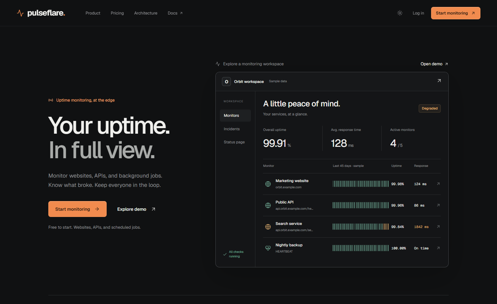
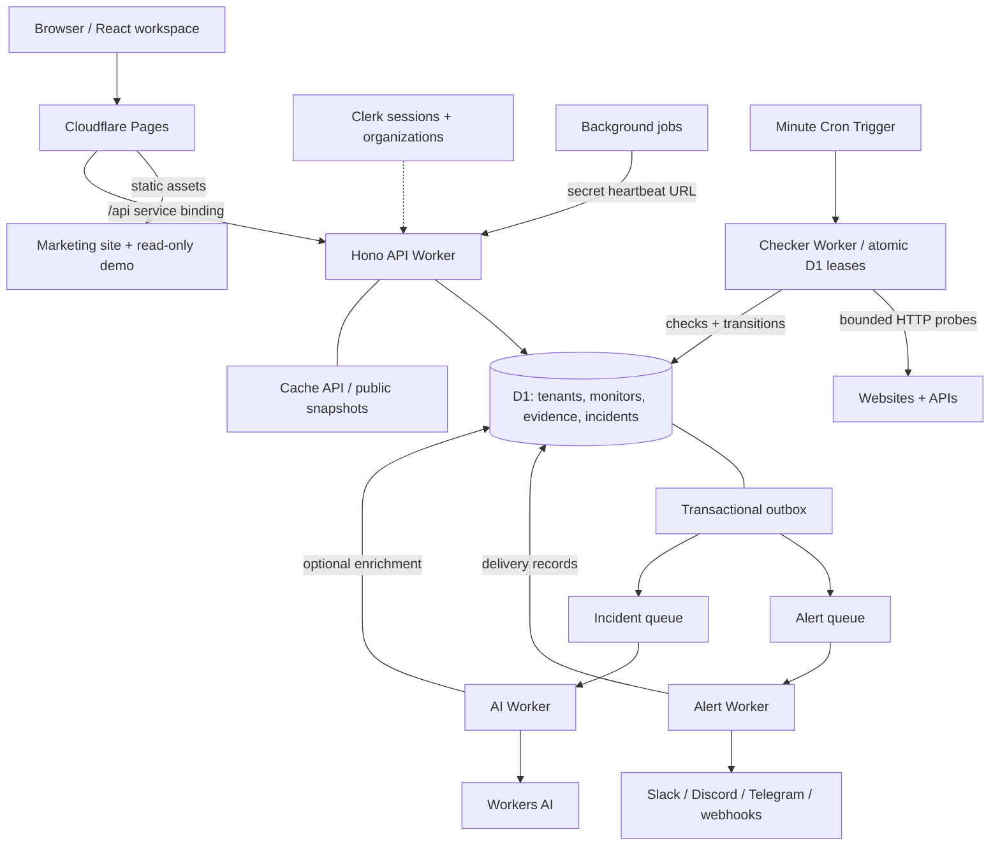
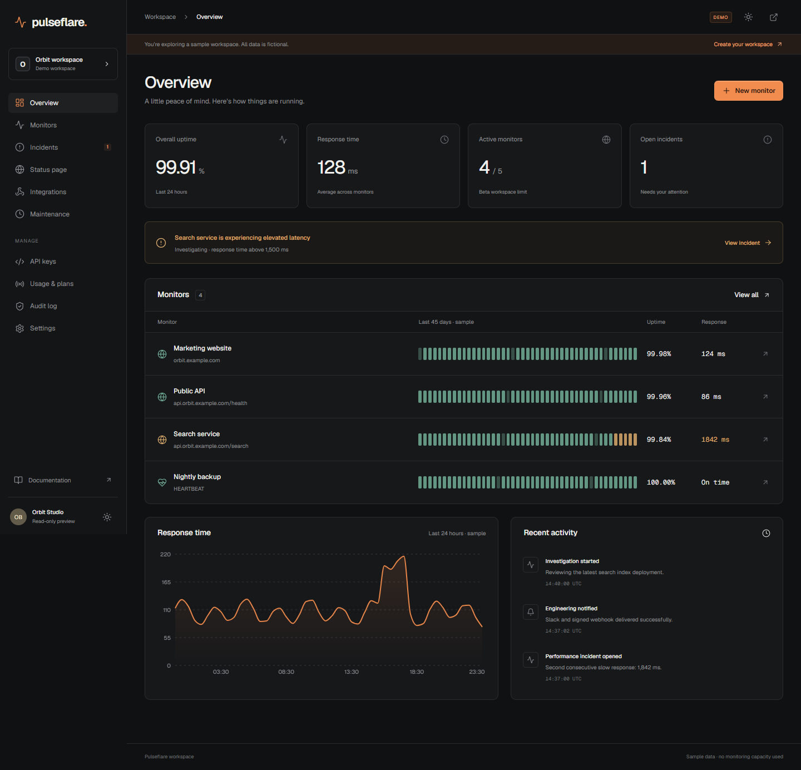
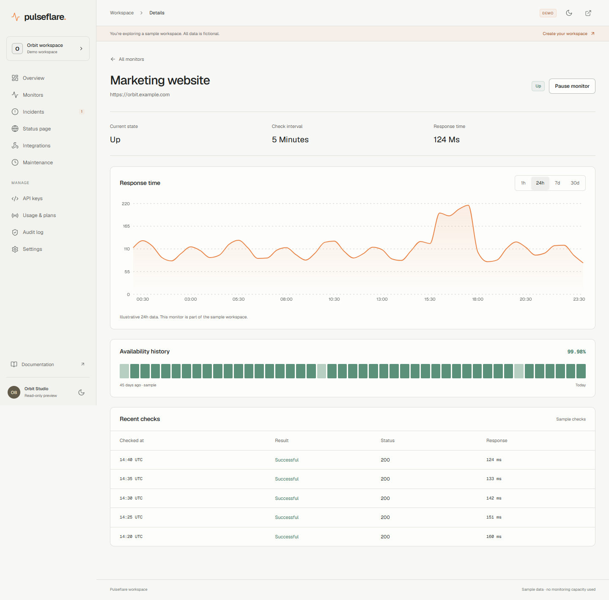
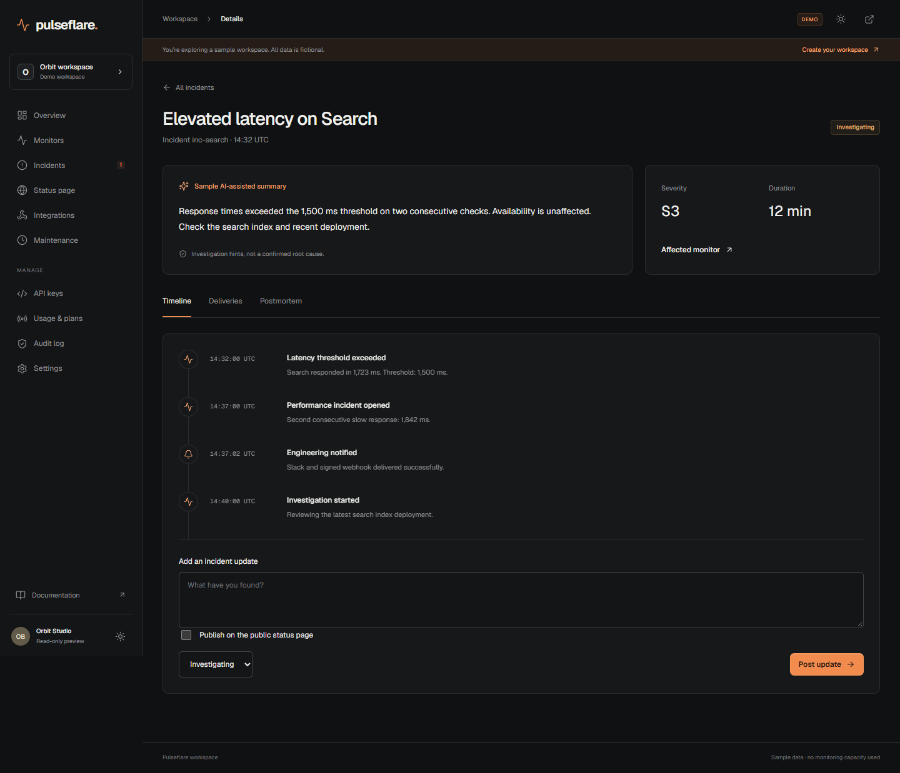
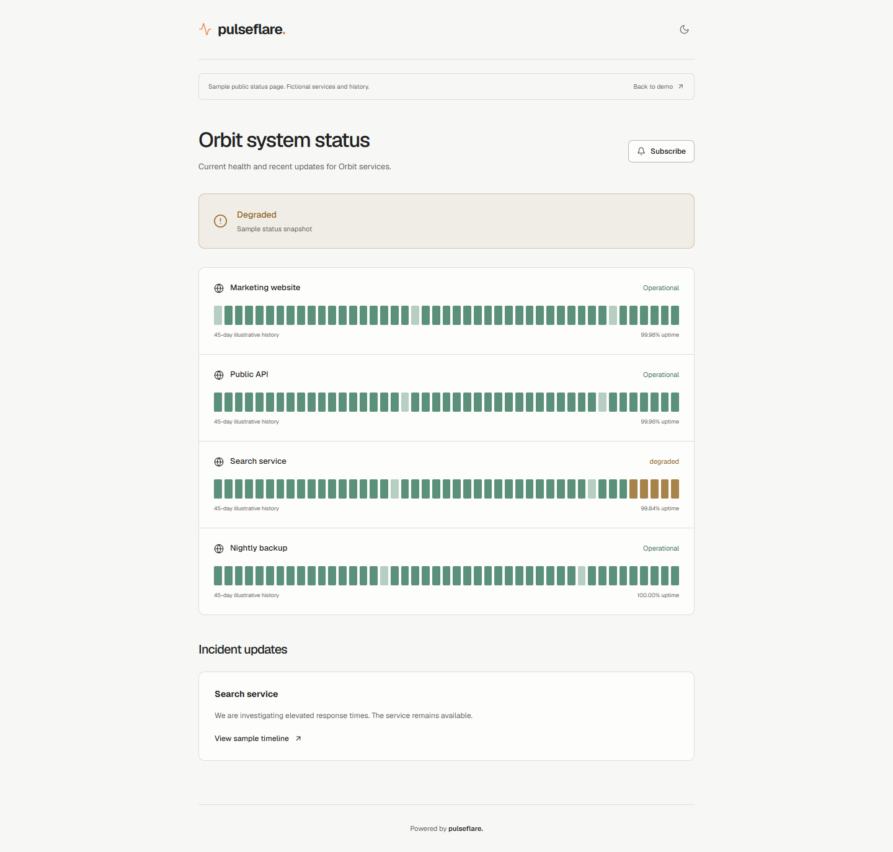
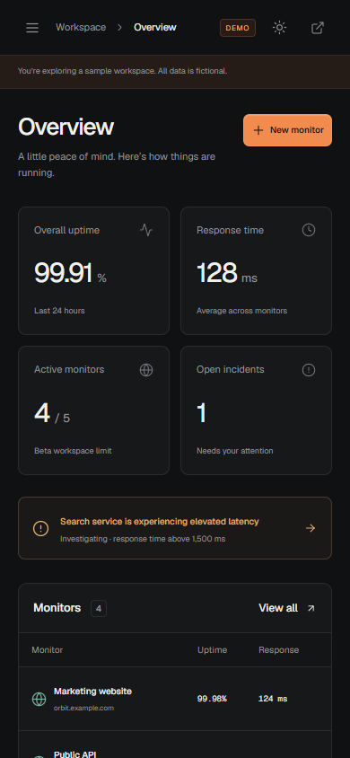

# Pulseflare

Multi-tenant uptime monitoring, built on Cloudflare's edge.

Monitor websites, APIs, and background jobs. Investigate incidents, receive alerts, and publish service health from one workspace. A working beta built with **Workers, D1, Queues, Cron Triggers, Workers AI, and Pages**; no traditional application server or external database.

[Live application](https://pulseflare.zlv.uk) · [Explore the demo](https://pulseflare.zlv.uk/demo) · [Public status preview](https://pulseflare.zlv.uk/status/demo) · [Architecture deep dive](docs/ARCHITECTURE.md)

[](https://pulseflare.zlv.uk)

## Try it in a minute

1. Open the [read-only workspace](https://pulseflare.zlv.uk/demo). No account required.
2. Inspect a [monitor's latency and availability](https://pulseflare.zlv.uk/demo/monitors/website), then an [incident's evidence and timeline](https://pulseflare.zlv.uk/demo/incidents/inc-search).
3. Visit the [public status page](https://pulseflare.zlv.uk/status/demo), or switch themes and try the mobile layout.
4. To use actual monitoring, [create an account](https://pulseflare.zlv.uk/signup), create a workspace, and add an HTTP or heartbeat monitor.

The demo's **Orbit** services, metrics, incidents, and reports are explicitly fictional. Signed-in workspaces use real Workers/D1 data. The current deployment intentionally uses development-mode Clerk; paid plans show a coming-soon notice and do not collect payments.

## What works today

| Capability | Implemented in the beta |
| --- | --- |
| HTTP monitoring | GET/HEAD/POST, five-minute minimum intervals, timeouts, status ranges, required/forbidden text, JSON-path assertions, encrypted request headers |
| Background-job heartbeats | Secret GET/POST ping URLs, expected intervals, grace periods, missed-run incidents, automatic recovery, secret rotation, pause/resume |
| Incident investigation | Two-failure outage confirmation, latency thresholds and anomaly detection, check evidence, timelines, acknowledgement, resolution, explicit public updates |
| Notifications | Slack, Discord, Telegram, HTTPS webhooks, encrypted integration settings, test delivery, delivery records, retries, optional webhook HMAC signatures |
| AI assistance | Workers AI summaries and advisory severity, validated output, deterministic fallback, ten enrichment events per workspace per day; alerts never wait for AI |
| Public status pages | Selected public monitors, availability history, published incident updates, edge-cached snapshots; private investigation stays private |
| Multi-tenant access | Clerk authentication and organizations, Admin/Member access, workspace-scoped queries, scoped/revocable API keys, audit events |
| Product experience | Responsive light/dark workspace, latency charts, searchable/filterable monitors, visible beta quotas, animated product-led homepage |

Beta capacity is deliberately bounded: **five active monitors per workspace, ten across this deployment, one status page per workspace, and seven days of raw check history**. Capacity is a guardrail, not a claim of commercial scale.

## Architecture



The diagram shows the **deployed MVP**, not the entire v2 design. Durable Object scheduling, R2 archives, and historical rollups are roadmap items.

### Engineering decisions worth a closer look

- **Persist before dispatch.** Check evidence, incident transitions, and outbox events are committed together. Independent queue handoffs keep an AI failure from blocking notifications. See [shared monitoring logic](packages/shared/src/monitoring.ts).
- **Claim work atomically.** The minute scheduler uses D1 leases to prevent overlapping HTTP checks. Heartbeat deadlines are checked independently of outbound probes. See the [checker](workers/checker/src/index.ts).
- **Treat delivery as at-least-once.** Recorded successes suppress duplicate queue messages; webhooks carry event IDs and idempotency headers. A lost provider response can still cause a repeat delivery. See the [alert consumer](workers/alert/src/index.ts).
- **Keep public reads cheap.** Cached public responses bypass D1 entirely, including the budget ledger. Private AI notes never enter the public snapshot. See the [API](workers/api/src/index.ts).
- **Budget rows, not requests.** Indexed history queries, bounded anomaly windows, incremental cleanup, atomic monitor caps, and a shared daily cost ledger protect the small deployment. See [budget enforcement](packages/shared/src/budget.ts) and [operating notes](docs/FREE_TIER_OPERATIONS.md).
- **Test security boundaries.** Workspace isolation, deny-default API-key scopes, revocation, secret encryption, unsafe URL variants, and migration compatibility have regression coverage. See [API tests](tests/api.test.ts), [security tests](tests/security.test.ts), and [MVP tests](tests/mvp.test.ts).

The project pauses new database work at **3 million reads / 60,000 writes per UTC day**. This is a conservative Worker-side guard, not an exact account-wide billing cap: concurrent work, migrations, and other applications require separate accounting. HTTP redirects are disabled and private literal addresses/internal names are rejected; DNS-aware rebinding protection remains a documented launch gate.

## Product tour

These are unretouched screenshots captured from the live deployment. Workspace screenshots use the labeled fictional demo; its extended history and postmortem preview do not imply those features are available in live workspaces.

### Workspace overview

Service health, monitor history, active incidents, and response-time trends in a single view.



<details>
<summary>More screenshots: monitor analytics, incident investigation, public status, and mobile</summary>

#### Monitor analytics · light theme



#### Incident investigation · dark theme



#### Customer-facing status page



#### Mobile workspace



</details>

## Verification

Verified for the current deployment on **September 30, 2026**:

- **73 tests across 10 files**, including SQLite-backed API/migration tests and a 10,000-old-check indexed-query regression fixture.
- All **six packages** typechecked; frontend production build and all four Worker deployment dry runs passed.
- **72 deployed route/viewport checks**: 24 routes at 1440, 390, and 360 px, plus pricing dialogs, filters, themes, mobile navigation, read-only behavior, and demo Markdown export.
- Authenticated end-to-end checks: email/password signup and verification, workspace creation, HTTP checks, heartbeat ping and cron-detected missed-run recovery, public-page publication, API-key use and revocation.
- Google OAuth handoff verified; the automated test did not complete Google account consent. Optional Cloudflare analytics DNS warnings are reported separately from application errors.

Test identities and monitoring resources are removed after verification, not presented as customers. See the [release record](docs/MVP_RELEASE.md) and [authenticated smoke scenario](scripts/authenticated-smoke.mjs).

## Run locally

Use **Node 24** and **pnpm 10**. SQLite-backed tests require Node 22.13 or newer.

```bash
git clone https://github.com/DebadityaHait/pulseflare.git
cd pulseflare
pnpm install
pnpm --filter frontend dev
```

Open `http://localhost:5173/demo`. The marketing site and demo work without credentials or a database.

For real local accounts, copy [.env.example](.env.example) to the root `.env`, provide your Clerk publishable key, and enable organizations plus email/password and Google sign-in in your development instance. Configure the API's Clerk secret and encryption key separately in ignored `workers/api/.dev.vars`. **Never put secrets in `VITE_*` variables.**

Apply local migrations and start the API in a second terminal:

```bash
pnpm exec wrangler d1 migrations apply pulseflare --local --config workers/api/wrangler.toml
pnpm exec wrangler dev --config workers/api/wrangler.toml --port 8787
```

Vite proxies `/api` to port 8787. Full scheduled monitoring, queue consumers, and AI need their respective Worker bindings; running the frontend alone does not run the monitoring pipeline. See [runtime and credential setup](docs/MVP_RELEASE.md).

```bash
pnpm typecheck
pnpm test
pnpm --filter frontend build
pnpm test:browser                         # Chrome + frontend dev server
node scripts/run-browser-smoke.mjs https://pulseflare.zlv.uk
```

Deployment configs intentionally contain the current account/resource IDs. **Replace them with your own before deploying a fork.** Provision D1 and both queues, configure secrets and consumers, apply migrations, deploy the Workers, then publish Pages with its API service binding. Do not apply seed data to a populated database.

## Source map

```text
frontend/             React/Vite UI, Clerk integration, live workspace, public demo
workers/api/          Hono API, authorization, heartbeat intake, public status/cache
workers/checker/      Cron scheduling, D1 leases, HTTP probes, deadlines, retention
workers/alert/        Notification adapters, delivery records, retry/idempotency
workers/ai/           Workers AI enrichment, output validation, quotas, fallbacks
packages/shared/      Monitoring transitions, outbox, security, budgets, validation
migrations/           Tenant schema, MVP state, indexes, atomic capacity triggers
tests/                Vitest + SQLite-backed integration/regression tests
scripts/              Browser verification, auth smoke tests, screenshot capture
docs/                 Architecture, operating limits, release records, screenshots
```

## Scope and roadmap

This is an operating beta, not a commercial SLA service. Monitoring and notification delivery are implemented; maintenance suppression, production Clerk, DNS-aware SSRF protection, dead-letter operator tools, longer history/R2 archival, SLOs, live postmortems, CLI/config-as-code, deployment annotations, push subscriptions, status widgets, and billing are deferred.

The [backlog](TODO.md) records dependencies and completion criteria. The [architecture notes](docs/ARCHITECTURE.md) explain the failure model and tradeoffs behind this release.
