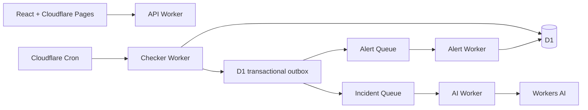

# Pulseflare

AI-enhanced uptime monitoring on Cloudflare Workers.

Pulseflare is a serverless monitoring system that checks HTTP services, detects outages and latency anomalies, summarizes incidents with Workers AI, scores severity, and routes alerts through async queues. It is built as a portfolio-grade full-stack project to demonstrate edge compute, durable storage, queues, AI integration, and a polished operational dashboard.

**Live demo:** https://pulseflare.pages.dev  
**API:** https://pulseflare-api.opener.workers.dev

## Functional Beta MVP

The website has an animated graphite/orange homepage with an interactive monitoring preview, themed Clerk signup, pricing with coming-soon paid plans, architecture/docs pages, and a responsive light/dark workspace. Signup opens real monitoring. `/demo` is a separate read-only Orbit workspace with explicitly fictional data and no API mutations.

```bash
pnpm install
pnpm --filter frontend dev
```

Open `http://localhost:5173`. Demo routes require no credentials. Real accounts use the development Clerk keys in the root `.env`; Vite exposes only the publishable key. Organizations must be enabled. Run `node scripts/configure-clerk.mjs` once to enable them on the development instance. Configure API Worker secrets separately; never place secrets in `VITE_*` variables.

The API uses Clerk organization sessions or scoped API keys. HTTP checks, assertions, encrypted headers, heartbeat deadlines/recovery/rotation, incident updates, encrypted notification integrations, delivery logs, public-page selection, and API keys are connected to real Workers/D1 data. Alerts dispatch independently of optional, quota-limited AI enrichment.

See [MVP runtime and release checks](docs/MVP_RELEASE.md) and the [deferred feature backlog](TODO.md). The frontend remains on `pulseflare.pages.dev`; a Pages service binding proxies `/api/*` to the API Worker. The active scheduler is a minute cron with atomic D1 leases. Durable Objects, archives/rollups, billing, and other advanced additions are deferred.

## Why It Matters

Most uptime monitors tell you that something failed. Pulseflare adds operational context:

- what failed,
- when it started,
- whether the incident is still open,
- how serious it is,
- what evidence supports the summary,
- and whether an alert should be routed immediately.

The AI layer is intentionally asynchronous and guarded by deterministic fallbacks, so monitoring stays reliable even if model output is slow or malformed.

## Highlights

- **Cloudflare-native architecture:** Workers, Cron Triggers, D1, KV, Queues, R2, Workers AI, and Pages.
- **AI incident intelligence:** incident summaries, anomaly explanations, and severity scoring via Workers AI.
- **Noise-aware alerting:** severity-based routing with Discord, Telegram, and generic webhook support.
- **Fast public status reads:** selected public monitor state cached for 30 seconds at the edge, evidence stored in D1.
- **Typed full-stack implementation:** strict TypeScript across shared logic, Workers, tests, and React frontend.
- **Product showcase:** responsive homepage, theme-aware workspace, public demo, incident exports, integrations preview, usage, status pages, and honest coming-soon plans.

## Architecture



## System Design

Pulseflare separates the critical monitoring path from slower AI and notification work.

- The checker Worker wakes on a one-minute cron, claims due HTTP checks with D1 leases, confirms outages after two failures, and detects missed heartbeat deadlines. It writes workspace-scoped evidence and transactional outbox events to D1.
- State transitions create queue messages instead of blocking the checker.
- The AI Worker consumes incident and anomaly events, calls Workers AI, validates model output, and stores summaries/severity in D1.
- The alert Worker consumes routed alert events and logs every delivery decision.
- The API Worker powers the dashboard and public status page without exposing secrets.

## AI Implementation

Workers AI is used for:

- incident summaries,
- anomaly explanations,
- severity scoring.

The default model is:

```text
@cf/meta/llama-3.1-8b-instruct
```

AI output is never trusted blindly. Severity is parsed as an integer from 1 to 5, summaries fall back to deterministic templates, and routing rules can override low AI scores for clearly serious incidents.

## Tech Stack

- **Frontend:** React, Vite, TypeScript, Recharts, lucide-react
- **Backend:** Cloudflare Workers, Hono, TypeScript
- **Data:** D1, KV, R2
- **Async:** Cloudflare Queues
- **AI:** Cloudflare Workers AI
- **Testing:** Vitest

## Project Structure

```text
packages/shared        Shared types, validation, status logic, anomaly detection, AI fallbacks
workers/checker        Scheduled uptime checks and incident/anomaly event creation
workers/api            REST API for dashboard, public status, settings, and archive trigger
workers/ai             Queue consumer for Workers AI summaries and severity scoring
workers/alert          Queue consumer for alert routing and delivery logs
frontend               React dashboard and public status page
migrations             D1 schema and seed data
```

## Verification

Current checks:

```bash
pnpm typecheck
pnpm test
pnpm build
pnpm test:browser
```

The tests cover shared monitoring logic, secret encryption, unsafe URL variants, demo evidence consistency, API-key scopes, workspace boundaries, and migrations against an existing SQLite database. The browser smoke suite requires Chrome and the frontend dev server on port 5173; it checks 24 routes at three widths, pricing dialogs, filters, read-only behavior, exports, themes, and console errors. Node 22.13+ is required for the SQLite-backed API tests (verified with Node 24).

## Resume Talking Points

- Designed a production-style serverless monitoring pipeline across multiple Cloudflare primitives.
- Used queues to isolate latency-sensitive health checks from AI processing and notification delivery.
- Implemented safe AI integration with validation, deterministic fallbacks, and severity override rules.
- Built a typed React dashboard and public status page backed by REST APIs and KV/D1 data flows.
- Deployed a complete full-stack system without a traditional server, container, or external database.

## Notes

This is a portfolio project, not a commercial SLA product. The complete v2 PRD is not implemented. Durable Object scheduling, robust retry/idempotency, automated retention, production onboarding, encrypted multi-channel delivery, and other launch gates are documented separately. Pricing does not accept payments, and no customer counts or endorsements are fabricated.
