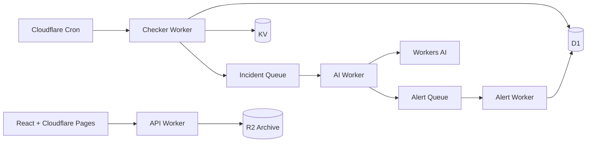

# Pulseflare

AI-enhanced uptime monitoring on Cloudflare Workers.

Pulseflare is a serverless monitoring system that checks HTTP services, detects outages and latency anomalies, summarizes incidents with Workers AI, scores severity, and routes alerts through async queues. It is built as a portfolio-grade full-stack project to demonstrate edge compute, durable storage, queues, AI integration, and a polished operational dashboard.

**Live demo:** https://pulseflare.pages.dev  
**API:** https://pulseflare-api.opener.workers.dev

## Presentation-first release (local, not deployed)

The new site has an animated graphite/orange homepage, original optimized artwork, interactive product previews, pricing with coming-soon dialogs, architecture and documentation pages, and a responsive light/dark workspace. `/demo` is a populated, read-only Orbit workspace. Its services, metrics, delivery records, and incident evidence are explicitly fictional; it makes no API requests or notifications. Incident reports can be exported as Markdown.

```bash
pnpm install
pnpm --filter frontend dev
```

Open `http://localhost:5173` for the website or `/demo` for the workspace. No credentials are needed. Leave `VITE_CLERK_PUBLISHABLE_KEY` unset for the portfolio deployment: login/signup then present a polished coming-soon page. For connected development, set the frontend `VITE_*` variables from `.env.example` in `frontend/.env.local`, and configure the corresponding API secrets and authorized origins separately.

The v2 API uses Clerk organization sessions or scoped API keys, not the retired browser-stored admin token. Basic HTTP monitor creation, listing, checks, pause/resume, incident updates, and workspace API-key management have connected UI paths. Authentication against a real Clerk tenant has not been end-to-end verified in this release.

See [release notes and launch gates](docs/PRESENTATION_RELEASE.md) before deploying workers or enabling public enrollment. The original live URLs above have not been updated by this implementation.

## Why It Matters

Most uptime monitors tell you that something failed. Pulseflare adds operational context:

- what failed,
- when it started,
- whether the incident is still open,
- how serious it is,
- what evidence supports the summary,
- and whether an alert should be routed immediately.

The AI layer is intentionally asynchronous and guarded by deterministic fallbacks, so monitoring stays reliable even if model output is slow or malformed.

## Highlights

- **Cloudflare-native architecture:** Workers, Cron Triggers, D1, KV, Queues, R2, Workers AI, and Pages.
- **AI incident intelligence:** incident summaries, anomaly explanations, and severity scoring via Workers AI.
- **Noise-aware alerting:** severity-based routing with Discord, Telegram, and generic webhook support.
- **Fast public status reads:** latest monitor state cached in KV, durable history stored in D1.
- **Typed full-stack implementation:** strict TypeScript across shared logic, Workers, tests, and React frontend.
- **Product showcase:** responsive homepage, theme-aware workspace, public demo, incident exports, integrations preview, usage, status pages, and honest coming-soon plans.

## Architecture



## System Design

Pulseflare separates the critical monitoring path from slower AI and notification work.

- The checker Worker wakes on a one-minute cron but respects each HTTP monitor's interval (minimum five minutes), performs checks with timeouts, writes workspace-scoped evidence to D1, and updates KV. It does not expose a public run-check endpoint.
- State transitions create queue messages instead of blocking the checker.
- The AI Worker consumes incident and anomaly events, calls Workers AI, validates model output, and stores summaries/severity in D1.
- The alert Worker consumes routed alert events and logs every delivery decision.
- The API Worker powers the dashboard and public status page without exposing secrets.

## AI Implementation

Workers AI is used for:

- incident summaries,
- anomaly explanations,
- severity scoring.

The default model is:

```text
@cf/meta/llama-3.1-8b-instruct
```

AI output is never trusted blindly. Severity is parsed as an integer from 1 to 5, summaries fall back to deterministic templates, and routing rules can override low AI scores for clearly serious incidents.

## Tech Stack

- **Frontend:** React, Vite, TypeScript, Recharts, lucide-react
- **Backend:** Cloudflare Workers, Hono, TypeScript
- **Data:** D1, KV, R2
- **Async:** Cloudflare Queues
- **AI:** Cloudflare Workers AI
- **Testing:** Vitest

## Project Structure

```text
packages/shared        Shared types, validation, status logic, anomaly detection, AI fallbacks
workers/checker        Scheduled uptime checks and incident/anomaly event creation
workers/api            REST API for dashboard, public status, settings, and archive trigger
workers/ai             Queue consumer for Workers AI summaries and severity scoring
workers/alert          Queue consumer for alert routing and delivery logs
frontend               React dashboard and public status page
migrations             D1 schema and seed data
```

## Verification

Current checks:

```bash
pnpm typecheck
pnpm test
pnpm build
pnpm test:browser
```

The tests cover shared monitoring logic, secret encryption, unsafe URL variants, demo evidence consistency, API-key scopes, workspace boundaries, and migrations against an existing SQLite database. The browser smoke suite requires Chrome and the frontend dev server on port 5173; it checks 24 routes at three widths, pricing dialogs, filters, read-only behavior, exports, themes, and console errors. Node 22.13+ is required for the SQLite-backed API tests (verified with Node 24).

## Resume Talking Points

- Designed a production-style serverless monitoring pipeline across multiple Cloudflare primitives.
- Used queues to isolate latency-sensitive health checks from AI processing and notification delivery.
- Implemented safe AI integration with validation, deterministic fallbacks, and severity override rules.
- Built a typed React dashboard and public status page backed by REST APIs and KV/D1 data flows.
- Deployed a complete full-stack system without a traditional server, container, or external database.

## Notes

This is a portfolio project, not a commercial SLA product. The complete v2 PRD is not implemented. Durable Object scheduling, robust retry/idempotency, automated retention, production onboarding, encrypted multi-channel delivery, and other launch gates are documented separately. Pricing does not accept payments, and no customer counts or endorsements are fabricated.
