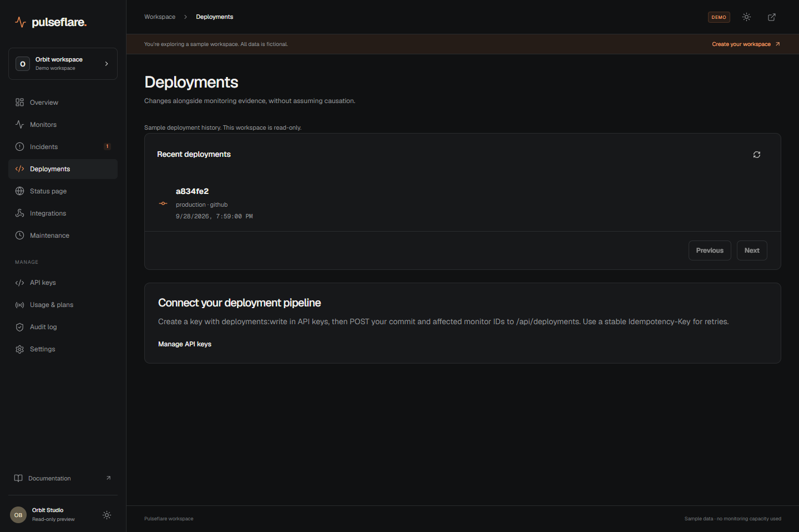
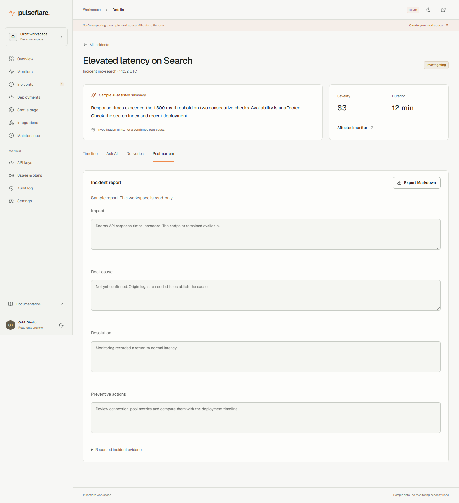
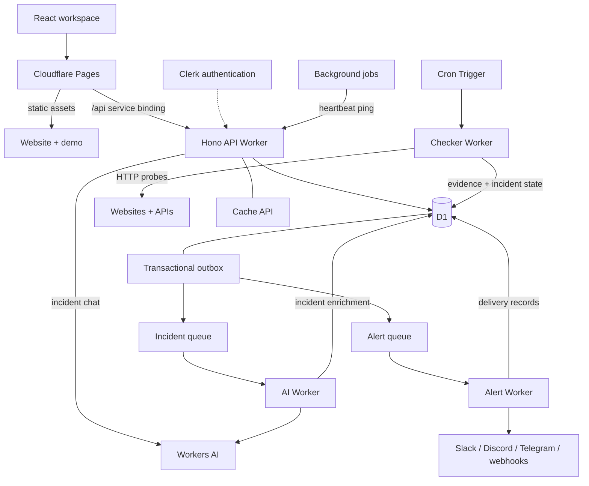

# Pulseflare

Uptime monitoring, built on Cloudflare's edge.

Monitor websites, APIs, and background jobs. Get notified when something breaks, investigate the incident, and keep customers informed with a public status page.

[Start monitoring](https://pulseflare.zlv.uk/signup) · [Live demo](https://pulseflare.zlv.uk/demo) · [Status page](https://pulseflare.zlv.uk/status/demo) · [Architecture](docs/ARCHITECTURE.md)

[](https://pulseflare.zlv.uk)

## Features

| Feature                   | Details                                                                                                                               |
| ------------------------- | ------------------------------------------------------------------------------------------------------------------------------------- |
| HTTP monitoring           | Scheduled GET, HEAD, and POST checks with status, text, and JSON-path assertions; configurable timeouts and encrypted request headers |
| Job heartbeats            | Monitor cron jobs and backups with secret ping URLs, grace periods, missed-run alerts, and automatic recovery                         |
| Incident management       | Confirmed outages, latency anomalies, evidence timelines, acknowledgement, resolution, and public incident updates                    |
| Notifications             | Slack, Discord, Telegram, and HTTPS webhooks with optional HMAC signing, test delivery, retries, and delivery logs                    |
| AI-assisted investigation | Workers AI summaries and severity assessments backed by recorded check evidence; alerts run independently of enrichment               |
| Incident chat             | Ask follow-up questions with Llama 3.3 on Workers AI; private D1 conversation memory and inspectable evidence sources                 |
| Public status pages       | Publish selected services, availability history, and incident updates through edge-cached pages                                       |
| Workspaces and access     | Clerk authentication and organizations, Admin/Member roles, scoped API keys, and audit logs                                           |
| Monitoring dashboard      | Response-time charts, searchable monitors, light and dark themes, and responsive layouts                                              |
| Monitor organization      | Production, staging, and development environments; multiple tags and URL-based filters                                                |
| Deployment annotations    | Record changes manually or through scoped CI keys; correlate timestamps with latency and incidents without assuming causation         |
| Postmortems               | Private, editable incident reports with recorded evidence, revision conflict protection, and Markdown export                          |
| Status distribution       | Embeddable SVG badges, RSS incident updates, and JSON snapshots of selected public services                                           |

## Product tour

[Explore the workspace](https://pulseflare.zlv.uk/demo) without signing in. The Orbit demo uses sample data; your own workspace connects to the monitoring service.

Open an incident and select **Ask AI** to investigate with Llama 3.3. Conversations retain follow-up context and include inspectable sources from recorded monitoring evidence.

Use **Deployments** to record a release against selected monitors. Its timestamps appear alongside monitoring evidence. The **Postmortem** tab turns an incident timeline into a private report you can edit, save, and export.


<details>
<summary>Monitor analytics, incident investigation, status pages, and mobile</summary>

### Monitor analytics


### Incident investigation


### Deployment history



### Private postmortems



### Public status page


### Mobile dashboard


</details>

## Architecture

Pulseflare runs on Cloudflare Pages, Workers, D1, Queues, and Workers AI. A same-origin service binding connects the frontend to the Hono API. Cron Triggers schedule checks; D1 holds configuration, evidence, and incident state.



The monitoring pipeline commits evidence, incident transitions, and outbox events together before dispatch. Alert delivery and AI enrichment use separate queues, so model latency does not delay notifications. Atomic D1 leases coordinate scheduled checks, while delivery records and webhook event IDs support idempotent processing.

Public cache hits bypass D1 entirely. Indexed history queries, bounded retention jobs, and a shared daily usage ledger keep database work predictable.

## Deployment integration

Create an API key with `deployments:write`. Submit a stable idempotency key for the same CI run so retries do not create duplicate annotations. Monitor IDs must belong to the key's workspace.

```bash
curl https://pulseflare.zlv.uk/api/deployments \
  -H "Authorization: Bearer $PULSEFLARE_API_KEY" \
  -H 'Content-Type: application/json' \
  -H "Idempotency-Key: deploy-$GITHUB_RUN_ID" \
  --data '{"version":"a834fe2","environment":"production","source":"github","monitorIds":["YOUR_MONITOR_ID"]}'
```

Deployment records are annotations, not a command to deploy code or run probes. Reports and chat stay private; public feeds contain only selected public services and published incident updates.

[Architecture and failure handling](docs/ARCHITECTURE.md) · [Operations](docs/OPERATIONS.md) · [Deployment](docs/DEPLOYMENT.md)

## Development

Node 24 and pnpm 10.

```bash
git clone https://github.com/DebadityaHait/pulseflare.git
cd pulseflare
pnpm install
pnpm --filter frontend dev
```

Open `http://localhost:5173`. The demo runs without credentials.

For authenticated development, copy [.env.example](.env.example) to the root `.env` and configure Clerk. Store API secrets in `workers/api/.dev.vars`, then apply migrations and start the API:

```bash
pnpm exec wrangler d1 migrations apply pulseflare --local --config workers/api/wrangler.toml
pnpm exec wrangler dev --config workers/api/wrangler.toml --port 8787
```

Vite proxies `/api` to port 8787. See [deployment setup](docs/DEPLOYMENT.md) for Worker bindings, queue consumers, scheduled checks, and secrets.

## Testing

```bash
pnpm typecheck
pnpm test
pnpm --filter frontend build
pnpm test:browser
```

The test suite covers monitor execution, heartbeat recovery, workspace isolation, API-key scopes, encryption, transactional dispatch, migration compatibility, database budgets, and incident chat. Chat tests exercise persisted follow-up context, tenant and user isolation, atomic quotas, idempotent requests, provider failures, and timeouts. Product tests cover deployment retries, report conflicts, retention, and public-feed privacy. Browser checks cover 25 routes at desktop and mobile widths, including themes, filters, navigation, and read-only interactions.

Browser tests require Chrome and a frontend server on port 5173. [Authenticated end-to-end tests](scripts/authenticated-smoke.mjs) exercise signup, workspace creation, HTTP checks, scheduled heartbeat incidents, real Llama 3.3 responses, conversation persistence and follow-ups, deployment recording, scoped CI retries, report editing/export, public feeds, and API-key revocation.

## Repository structure

```text
frontend/          React/Vite application and Clerk integration
workers/api/       Hono API, authorization, heartbeats, public status
workers/checker/   Scheduled probes, leases, deadlines, retention
workers/alert/     Notification delivery and retries
workers/ai/        Incident enrichment with Workers AI
packages/shared/  Monitoring state, outbox, security, budgets, validation
migrations/       D1 schema, indexes, capacity enforcement
tests/            Unit and SQLite-backed integration tests
scripts/          Deployment utilities and browser tests
docs/             Architecture, deployment, operations, screenshots
```
