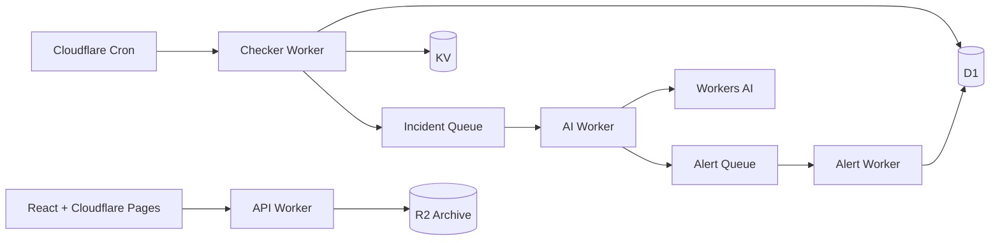

# Pulseflare

AI-enhanced uptime monitoring on Cloudflare Workers.

Pulseflare is a serverless monitoring system that checks HTTP services, detects outages and latency anomalies, summarizes incidents with Workers AI, scores severity, and routes alerts through async queues. It is built as a portfolio-grade full-stack project to demonstrate edge compute, durable storage, queues, AI integration, and a polished operational dashboard.

**Live demo:** https://pulseflare.pages.dev  
**API:** https://pulseflare-api.opener.workers.dev

## Why It Matters

Most uptime monitors tell you that something failed. Pulseflare adds operational context:

- what failed,
- when it started,
- whether the incident is still open,
- how serious it is,
- what evidence supports the summary,
- and whether an alert should be routed immediately.

The AI layer is intentionally asynchronous and guarded by deterministic fallbacks, so monitoring stays reliable even if model output is slow or malformed.

## Highlights

- **Cloudflare-native architecture:** Workers, Cron Triggers, D1, KV, Queues, R2, Workers AI, and Pages.
- **AI incident intelligence:** incident summaries, anomaly explanations, and severity scoring via Workers AI.
- **Noise-aware alerting:** severity-based routing with Discord, Telegram, and generic webhook support.
- **Fast public status reads:** latest monitor state cached in KV, durable history stored in D1.
- **Typed full-stack implementation:** strict TypeScript across shared logic, Workers, tests, and React frontend.
- **Modern dashboard:** dark-mode glass UI with public status, admin dashboard, monitor details, incident summaries, and archive controls.

## Architecture



## System Design

Pulseflare separates the critical monitoring path from slower AI and notification work.

- The checker Worker runs on a one-minute cron, performs HTTP checks with timeouts, writes raw check results to D1, and updates KV with the latest status.
- State transitions create queue messages instead of blocking the checker.
- The AI Worker consumes incident and anomaly events, calls Workers AI, validates model output, and stores summaries/severity in D1.
- The alert Worker consumes routed alert events and logs every delivery decision.
- The API Worker powers the dashboard and public status page without exposing secrets.

## AI Implementation

Workers AI is used for:

- incident summaries,
- anomaly explanations,
- severity scoring.

The default model is:

```text
@cf/meta/llama-3.1-8b-instruct
```

AI output is never trusted blindly. Severity is parsed as an integer from 1 to 5, summaries fall back to deterministic templates, and routing rules can override low AI scores for clearly serious incidents.

## Tech Stack

- **Frontend:** React, Vite, TypeScript, Recharts, lucide-react
- **Backend:** Cloudflare Workers, Hono, TypeScript
- **Data:** D1, KV, R2
- **Async:** Cloudflare Queues
- **AI:** Cloudflare Workers AI
- **Testing:** Vitest

## Project Structure

```text
packages/shared        Shared types, validation, status logic, anomaly detection, AI fallbacks
workers/checker        Scheduled uptime checks and incident/anomaly event creation
workers/api            REST API for dashboard, public status, settings, and archive trigger
workers/ai             Queue consumer for Workers AI summaries and severity scoring
workers/alert          Queue consumer for alert routing and delivery logs
frontend               React dashboard and public status page
migrations             D1 schema and seed data
```

## Verification

Current checks:

```bash
pnpm typecheck
pnpm test
pnpm build
```

The test suite covers core non-Cloudflare logic including anomaly detection, state transitions, URL validation, prompt construction, and severity fallback behavior.

## Resume Talking Points

- Designed a production-style serverless monitoring pipeline across multiple Cloudflare primitives.
- Used queues to isolate latency-sensitive health checks from AI processing and notification delivery.
- Implemented safe AI integration with validation, deterministic fallbacks, and severity override rules.
- Built a typed React dashboard and public status page backed by REST APIs and KV/D1 data flows.
- Deployed a complete full-stack system without a traditional server, container, or external database.

## Notes

This is a portfolio project, not a commercial SLA product. v1 focuses on HTTP/HTTPS monitoring, incident intelligence, and alert routing. Future extensions could include multi-user auth, SSL expiry checks, DNS checks, maintenance windows, regional validation, and custom status-page domains.
