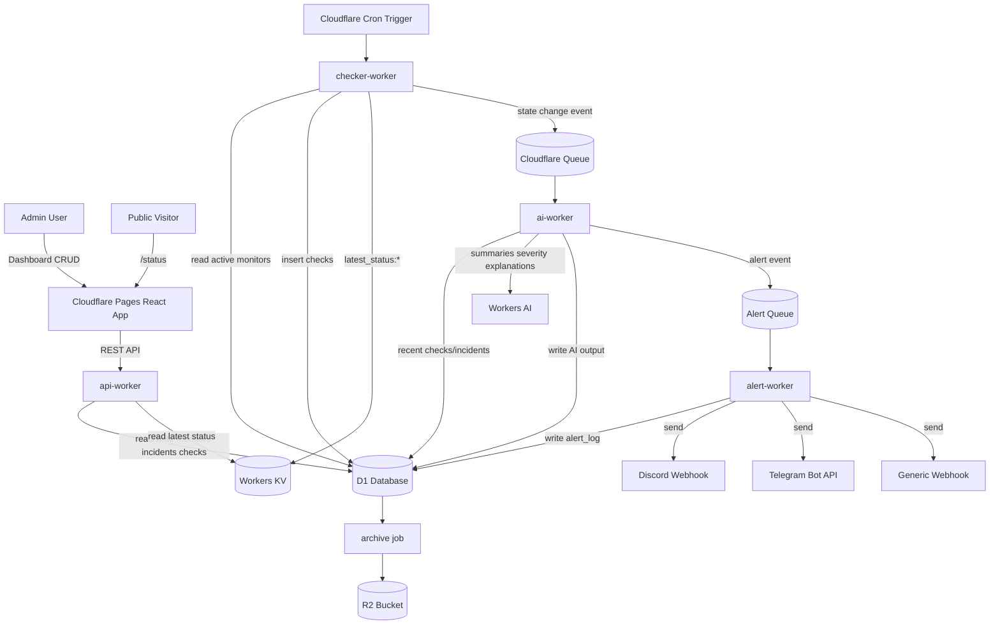
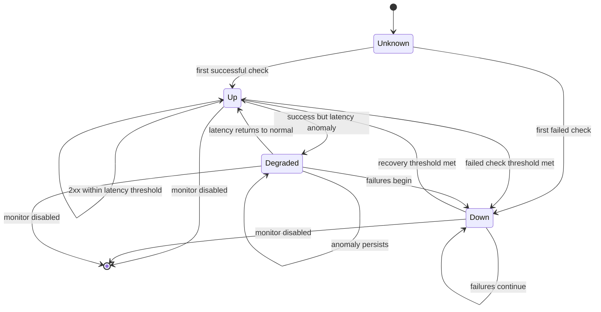

# Product Requirements Document: AI-Enhanced Uptime Monitor

**Version:** 1.0  
**Status:** Draft, build-ready  
**Primary audience:** Claude Code, OpenAI Codex, software engineering reviewers, portfolio evaluators  
**Target builder:** Solo developer using Claude Code/Codex as implementation agent  
**Primary stack:** Cloudflare Workers, D1, KV, Queues, R2, Workers AI, Cloudflare Pages, React, TypeScript  
**Document purpose:** This PRD is written as a product specification and as an execution contract for an AI coding agent. It should be copied into `PRD.md` at the root of the repository and used alongside `CLAUDE.md` / `AGENTS.md`.

---

## 0. Agent Read-Me

You are building an **AI-enhanced uptime monitor** that runs primarily on Cloudflare’s developer platform. The product monitors HTTP/HTTPS endpoints, records health checks, detects outages and latency anomalies, summarizes incidents using Workers AI, scores severity, and routes alerts intelligently.

Build this project as a production-quality portfolio application, not a toy demo.

### Non-negotiable build constraints

1. Use **TypeScript** for all Workers and frontend code.
2. Use **Cloudflare-native primitives** for core infrastructure:
   - Workers for compute.
   - Cron Triggers for scheduled checks.
   - D1 for relational persistence.
   - KV for latest-status cache and low-latency reads.
   - Queues for asynchronous incident/AI processing.
   - R2 for optional archival exports.
   - Workers AI for incident summarization, anomaly explanations, and severity scoring.
   - Cloudflare Pages for frontend deployment.
3. Do **not** use Express, Prisma, MongoDB, Postgres, Redis, Docker, a custom VM, or a traditional backend server.
4. Do **not** call OpenAI, Anthropic, Gemini, or external LLM APIs in v1.
5. External notification endpoints are allowed only for delivery integrations:
   - Discord webhook.
   - Telegram Bot API.
   - Optional generic webhook.
6. All SQL must use prepared statements.
7. AI output must never be trusted blindly. Parse, validate, and fall back deterministically.
8. Every phase must be independently testable before moving to the next.

### Build order for Claude Code / Codex

Build in this order:

1. Repository scaffold and shared types.
2. D1 schema and local seed data.
3. Checker Worker with scheduled handler.
4. API Worker with Hono and auth.
5. Queue pipeline between checker and AI processor.
6. AI Worker with deterministic fallbacks.
7. Alert Worker / alert module.
8. React dashboard.
9. Tests, observability, README, deployment guide.

---

## 1. Executive Summary

Most small teams learn their service is broken from users before their monitoring tool gives useful context. Traditional uptime tools often provide a red/green status, raw response codes, and noisy notifications. They rarely explain what changed, whether the issue is likely serious, or what the developer should check first.

This product is an **AI-native uptime monitor** that turns health checks into actionable incident intelligence. It continuously monitors configured HTTP endpoints, stores check history, identifies outages and latency anomalies, and uses Workers AI to generate concise explanations and severity classifications.

The product is designed to demonstrate deep Cloudflare platform competence while remaining useful as a real operational tool for indie developers, student projects, small SaaS products, APIs, portfolio sites, and hackathon deployments.

### Primary differentiators

| Differentiator | Description |
|---|---|
| AI Incident Summarizer | Converts raw check history into a short, actionable, human-readable incident summary. |
| Anomaly Explainer | Detects abnormal latency patterns and explains likely causes. |
| Smart Alert Router | Uses AI-assisted severity classification plus deterministic rules to suppress noise and escalate serious incidents. |
| Cloudflare-native architecture | Runs without a traditional backend server and uses Cloudflare Workers, D1, KV, Queues, R2, Workers AI, and Pages. |
| Portfolio-grade implementation | Includes typed APIs, schema migrations, tests, dashboard, deployment docs, and clear architecture diagrams. |

---

## 2. Problem Statement

### 2.1 Current workflow problem

A common workflow for small developers looks like this:

1. A service goes down.
2. A user reports the failure in Discord, Twitter/X, Slack, or email.
3. The developer opens a monitoring dashboard.
4. The dashboard shows a red dot, a failed status code, and maybe a latency chart.
5. The developer spends time checking logs, deployments, DNS, hosting dashboards, and recent code changes.
6. The developer manually writes a status update or alert message.

This workflow is too slow and too manual. The monitoring tool notices symptoms but does not explain them.

### 2.2 Core user pain

Users do not just need to know that something is down. They need to know:

- What failed?
- When did it start?
- Is it still ongoing?
- Did latency degrade before failure?
- Is it one blip or a real outage?
- Should I wake someone up?
- What should I check first?
- What message should I send to users?

### 2.3 Market gap

Existing uptime tools are good at pings and dashboards, but many are weak at interpretation.

| Tool category | What it does well | Gap |
|---|---|---|
| Basic uptime monitors | Ping endpoints and notify on downtime | Little or no context, noisy alerts |
| Status-page tools | Public communication and SLA display | Often expensive for small teams |
| Observability suites | Deep logs, traces, metrics | Overkill for indie projects, not free, complex setup |
| Open-source uptime tools | Self-hosted control | Need servers/databases, often no AI intelligence |
| This product | Monitoring + explanation + routing | v1 must prove usefulness and reliability |

---

## 3. Product Vision

Build the monitoring tool a solo developer wishes they had:

> “Tell me when my service is unhealthy, explain what likely happened, show me the evidence, and only interrupt me when it matters.”

### Vision pillars

1. **Simple setup:** Add a URL and get monitoring.
2. **Useful intelligence:** AI explains incidents in plain English.
3. **Noise reduction:** Not every blip becomes an urgent alert.
4. **Transparent evidence:** AI summaries always link back to raw check data.
5. **Cloudflare-first:** The architecture showcases modern edge-native application design.
6. **Portfolio quality:** The repo should be impressive to technical reviewers.

---

## 4. Target Users

### Persona A: Indie SaaS developer

- Runs a small API, landing page, or dashboard.
- Wants alerts without paying for a full observability platform.
- Needs clear messages when something breaks.
- Values simple setup and low cost.

### Persona B: Student / internship applicant

- Wants a technically impressive project.
- Needs to show full-stack ability.
- Wants to demonstrate serverless, edge, database, queues, AI, and frontend skills.
- Needs a clean demo and README.

### Persona C: Hackathon team

- Deploys quickly.
- Needs public status page.
- Wants AI features that are easy to demo.
- Accepts some limits but needs the app to work end-to-end.

### Persona D: Small engineering team

- Has a few production endpoints.
- Already has logs but wants simple public uptime and alert triage.
- Wants to reduce alert fatigue.

---

## 5. Goals and Non-Goals

### 5.1 Goals

| Goal | Description |
|---|---|
| G1 | Monitor HTTP/HTTPS endpoints every minute. |
| G2 | Store check history and incidents in D1. |
| G3 | Cache latest status in KV for fast dashboard/status reads. |
| G4 | Detect state transitions: UP → DOWN, DOWN → UP, DEGRADED. |
| G5 | Generate AI incident summaries through Workers AI. |
| G6 | Detect latency anomalies using a deterministic statistical algorithm. |
| G7 | Generate AI explanations for detected anomalies. |
| G8 | Score incident severity using AI plus rule-based fallback. |
| G9 | Route alerts based on severity and user-configured channels. |
| G10 | Provide a React dashboard and public status page. |
| G11 | Produce clean docs, tests, and deployment instructions. |

### 5.2 Non-goals for v1

| Non-goal | Reason |
|---|---|
| Multi-tenant SaaS billing | Too much scope for v1. |
| OAuth/social login | v1 uses single admin token. |
| TCP, ICMP ping, SSL expiry, DNS checks | Future versions. HTTP/HTTPS only in v1. |
| SMS/phone-call alerting | Requires paid third-party services. |
| Log ingestion | Product is uptime-focused, not a full observability platform. |
| Fine-tuned AI models | Use Workers AI hosted models only. |
| Mobile app | Responsive web is enough for v1. |
| Complex RBAC | Single-user admin in v1. |
| Guaranteed SLA | Portfolio project, not commercial SLA product. |

---

## 6. Success Metrics

### 6.1 Product success metrics

| Metric | Target | Measurement |
|---|---:|---|
| Time to add first monitor | < 3 minutes | Manual onboarding test |
| Check interval | 60 seconds default | Cron + stored check timestamps |
| State-change detection delay | < 90 seconds | Compare failure start to incident creation |
| AI summary generation | < 15 seconds after incident event | Queue event timestamp to summary timestamp |
| Dashboard status freshness | < 60 seconds stale | KV latest status timestamp |
| False urgent alert rate | < 20% in test scenarios | Alert log review |
| Manual setup complexity | ≤ 10 documented commands | README validation |
| Demo reliability | 5-minute live demo without errors | Demo checklist |

### 6.2 Engineering success metrics

| Metric | Target |
|---|---:|
| TypeScript strict mode | Enabled |
| Unit test coverage for core logic | ≥ 70% for non-Cloudflare logic |
| SQL migrations | Versioned |
| API endpoints | Covered by integration tests or documented curl examples |
| Error handling | All Worker entrypoints have top-level try/catch |
| AI fallbacks | 100% of AI calls have deterministic fallback |
| Secrets | No secrets committed |
| README | Includes architecture, setup, demo flow, and screenshots/GIFs |

---

## 7. Product Scope

### 7.1 v1 feature list

| ID | Feature | Priority |
|---|---|---|
| F-01 | HTTP/HTTPS monitor CRUD | P0 |
| F-02 | Scheduled health checks | P0 |
| F-03 | D1 check history | P0 |
| F-04 | KV latest status cache | P0 |
| F-05 | Incident creation and resolution | P0 |
| F-06 | Public status endpoint | P0 |
| F-07 | AI incident summarizer | P0 |
| F-08 | Latency anomaly detection | P1 |
| F-09 | AI anomaly explainer | P1 |
| F-10 | AI severity scorer | P1 |
| F-11 | Discord/Telegram/generic webhook alerting | P1 |
| F-12 | React dashboard | P0 |
| F-13 | Public status page | P0 |
| F-14 | R2 archival export | P2 |
| F-15 | Demo seed script | P1 |
| F-16 | Deployment docs | P0 |

### 7.2 v2 candidate features

- Multi-user auth.
- OAuth login.
- Per-monitor check interval.
- SSL certificate expiry monitoring.
- DNS monitoring.
- Regional multi-check validation.
- Maintenance windows.
- Status page custom domains.
- Incident comments.
- AI-generated public postmortems.
- Webhook signatures.
- Slack integration.
- Email alerts via approved provider.
- Durable Object coordinator for stronger per-monitor state consistency.
- Browser synthetic checks.

---

## 8. User Stories

### 8.1 Monitoring setup

**As an admin**, I want to create a monitor by entering a name and URL so that the system can begin checking my service.

Acceptance criteria:

- URL must be valid HTTP or HTTPS.
- Name is required.
- Method defaults to `GET`.
- Timeout defaults to 10 seconds.
- Monitor is active by default.
- API returns the created monitor with ID.
- Latest status is initialized after the first check.

### 8.2 Health check execution

**As an admin**, I want checks to run automatically every minute so that service state stays current.

Acceptance criteria:

- Scheduled Worker runs once per configured cron interval.
- Active monitors are fetched from D1.
- Each monitor is checked with timeout.
- Result is inserted into `checks`.
- Latest status is updated in KV.
- State transition creates a queue event.
- Worker handles failures per monitor without aborting the whole batch.

### 8.3 Incident summary

**As an on-call developer**, I want the system to summarize an incident so that I know what likely happened.

Acceptance criteria:

- Summary is generated only after an incident event.
- Prompt includes monitor name, URL path, recent statuses, recent latencies, error messages, and timestamps.
- Output is 2–3 sentences.
- Output is stored in D1.
- Dashboard shows summary with “AI-generated” label.
- If AI call fails, fallback summary is generated from deterministic template.

### 8.4 Anomaly explanation

**As a developer**, I want unusual latency spikes explained so that I can distinguish minor blips from real degradation.

Acceptance criteria:

- System computes rolling mean and standard deviation.
- System computes z-score for current latency.
- If z-score exceeds threshold, an anomaly event is created.
- AI explanation is generated from recent samples and statistics.
- Explanation is stored and displayed.
- If insufficient data exists, anomaly detection is skipped.

### 8.5 Smart alert routing

**As an on-call developer**, I want only serious incidents to notify me immediately so that I am not interrupted by noise.

Acceptance criteria:

- AI severity output must be parsed as integer 1–5.
- Deterministic rules can override AI score upward for clearly critical cases.
- Severity 1 is suppressed.
- Severity 2–3 is batched or shown in dashboard only.
- Severity 4–5 sends immediate alert.
- All decisions are logged in `alert_log`.

### 8.6 Public status page

**As a user of the monitored service**, I want to see whether the service is operational so that I know if an issue is known.

Acceptance criteria:

- Public status page requires no auth.
- Shows each public monitor, status, uptime, and active incidents.
- Does not expose secrets, webhook URLs, admin token, or private notes.
- Updates automatically every 30 seconds.
- Is mobile responsive.

---

## 9. System Overview

### 9.1 Architecture summary

The system is split into small Worker entrypoints, each with one responsibility:

| Component | Runtime | Responsibility |
|---|---|---|
| Checker Worker | Cloudflare Worker + Cron Trigger | Runs health checks and writes raw results. |
| API Worker | Cloudflare Worker + Hono | Provides REST API for dashboard and admin operations. |
| AI Worker | Cloudflare Worker + Queue consumer | Generates summaries, anomaly explanations, and severity scores. |
| Alert Worker / module | Cloudflare Worker + Queue consumer or shared module | Sends notification messages and logs routing decisions. |
| Frontend | React + Vite + Cloudflare Pages | Dashboard and public status page. |
| D1 | SQLite-compatible serverless DB | Durable relational storage. |
| KV | Global key-value cache | Latest status and lightweight public reads. |
| Queue | Cloudflare Queues | Async event pipeline. |
| R2 | Object storage | Optional archives and exports. |
| Workers AI | Hosted models | AI summaries and classifications. |

### 9.2 Mermaid architecture diagram



### 9.3 State machine



---

## 10. Data Model

All persistent relational data lives in D1. KV is used only for latest state/cache, not as source of truth.

### 10.1 Entity overview

| Entity | Purpose |
|---|---|
| `monitors` | User-configured endpoints. |
| `checks` | Individual health check results. |
| `incidents` | Outage/degradation events. |
| `anomalies` | Latency anomaly records. |
| `alert_log` | Notification routing and delivery audit trail. |
| `settings` | App-level config and feature flags. |
| `public_status_config` | Status page branding and visibility. |

### 10.2 D1 schema

Create `migrations/0001_schema.sql`.

```sql
PRAGMA foreign_keys = ON;

CREATE TABLE IF NOT EXISTS monitors (
  id TEXT PRIMARY KEY DEFAULT (lower(hex(randomblob(8)))),
  name TEXT NOT NULL,
  url TEXT NOT NULL,
  method TEXT NOT NULL DEFAULT 'GET',
  expected_status_min INTEGER NOT NULL DEFAULT 200,
  expected_status_max INTEGER NOT NULL DEFAULT 299,
  interval_s INTEGER NOT NULL DEFAULT 60,
  timeout_ms INTEGER NOT NULL DEFAULT 10000,
  active INTEGER NOT NULL DEFAULT 1,
  public INTEGER NOT NULL DEFAULT 1,
  tags TEXT NOT NULL DEFAULT '[]',
  notify_discord_webhook TEXT,
  notify_telegram_chat_id TEXT,
  notify_generic_webhook TEXT,
  created_at TEXT NOT NULL DEFAULT (strftime('%Y-%m-%dT%H:%M:%SZ', 'now')),
  updated_at TEXT NOT NULL DEFAULT (strftime('%Y-%m-%dT%H:%M:%SZ', 'now'))
);

CREATE INDEX IF NOT EXISTS idx_monitors_active ON monitors(active);
CREATE INDEX IF NOT EXISTS idx_monitors_public ON monitors(public);

CREATE TABLE IF NOT EXISTS checks (
  id INTEGER PRIMARY KEY AUTOINCREMENT,
  monitor_id TEXT NOT NULL REFERENCES monitors(id) ON DELETE CASCADE,
  status INTEGER NOT NULL,
  ok INTEGER NOT NULL,
  latency_ms INTEGER NOT NULL,
  region TEXT,
  error_code TEXT,
  error_msg TEXT,
  response_size_bytes INTEGER,
  checked_at TEXT NOT NULL DEFAULT (strftime('%Y-%m-%dT%H:%M:%SZ', 'now'))
);

CREATE INDEX IF NOT EXISTS idx_checks_monitor_time
  ON checks(monitor_id, checked_at DESC);

CREATE INDEX IF NOT EXISTS idx_checks_monitor_ok_time
  ON checks(monitor_id, ok, checked_at DESC);

CREATE TABLE IF NOT EXISTS incidents (
  id TEXT PRIMARY KEY DEFAULT (lower(hex(randomblob(8)))),
  monitor_id TEXT NOT NULL REFERENCES monitors(id) ON DELETE CASCADE,
  type TEXT NOT NULL DEFAULT 'outage',
  status TEXT NOT NULL DEFAULT 'open',
  started_at TEXT NOT NULL,
  resolved_at TEXT,
  trigger_check_id INTEGER REFERENCES checks(id),
  recovery_check_id INTEGER REFERENCES checks(id),
  failing_status INTEGER,
  failing_error_code TEXT,
  ai_summary TEXT,
  ai_summary_status TEXT NOT NULL DEFAULT 'pending',
  ai_severity INTEGER,
  ai_severity_reason TEXT,
  created_at TEXT NOT NULL DEFAULT (strftime('%Y-%m-%dT%H:%M:%SZ', 'now')),
  updated_at TEXT NOT NULL DEFAULT (strftime('%Y-%m-%dT%H:%M:%SZ', 'now'))
);

CREATE INDEX IF NOT EXISTS idx_incidents_monitor_time
  ON incidents(monitor_id, started_at DESC);

CREATE INDEX IF NOT EXISTS idx_incidents_status
  ON incidents(status);

CREATE TABLE IF NOT EXISTS anomalies (
  id TEXT PRIMARY KEY DEFAULT (lower(hex(randomblob(8)))),
  monitor_id TEXT NOT NULL REFERENCES monitors(id) ON DELETE CASCADE,
  check_id INTEGER REFERENCES checks(id),
  latency_ms INTEGER NOT NULL,
  rolling_mean_ms REAL NOT NULL,
  rolling_stddev_ms REAL NOT NULL,
  z_score REAL NOT NULL,
  ai_explanation TEXT,
  ai_status TEXT NOT NULL DEFAULT 'pending',
  created_at TEXT NOT NULL DEFAULT (strftime('%Y-%m-%dT%H:%M:%SZ', 'now'))
);

CREATE INDEX IF NOT EXISTS idx_anomalies_monitor_time
  ON anomalies(monitor_id, created_at DESC);

CREATE TABLE IF NOT EXISTS alert_log (
  id INTEGER PRIMARY KEY AUTOINCREMENT,
  incident_id TEXT REFERENCES incidents(id) ON DELETE CASCADE,
  anomaly_id TEXT REFERENCES anomalies(id) ON DELETE CASCADE,
  monitor_id TEXT NOT NULL REFERENCES monitors(id) ON DELETE CASCADE,
  channel TEXT NOT NULL,
  severity INTEGER NOT NULL,
  route_decision TEXT NOT NULL,
  routed INTEGER NOT NULL DEFAULT 1,
  delivery_status TEXT NOT NULL DEFAULT 'pending',
  delivery_error TEXT,
  sent_at TEXT,
  created_at TEXT NOT NULL DEFAULT (strftime('%Y-%m-%dT%H:%M:%SZ', 'now'))
);

CREATE INDEX IF NOT EXISTS idx_alert_log_monitor_time
  ON alert_log(monitor_id, created_at DESC);

CREATE TABLE IF NOT EXISTS settings (
  key TEXT PRIMARY KEY,
  value TEXT NOT NULL,
  updated_at TEXT NOT NULL DEFAULT (strftime('%Y-%m-%dT%H:%M:%SZ', 'now'))
);

CREATE TABLE IF NOT EXISTS public_status_config (
  id TEXT PRIMARY KEY DEFAULT 'default',
  page_title TEXT NOT NULL DEFAULT 'Service Status',
  page_description TEXT NOT NULL DEFAULT 'Current system status and recent incidents.',
  brand_color TEXT NOT NULL DEFAULT '#f6821f',
  show_history_days INTEGER NOT NULL DEFAULT 7,
  updated_at TEXT NOT NULL DEFAULT (strftime('%Y-%m-%dT%H:%M:%SZ', 'now'))
);

INSERT OR IGNORE INTO public_status_config (id) VALUES ('default');
```

### 10.3 KV keys

| Key | Value | TTL | Purpose |
|---|---|---:|---|
| `latest_status:{monitorId}` | JSON status summary | None | Fast dashboard/status reads |
| `monitor_state:{monitorId}` | `up`, `down`, `degraded`, `unknown` | None | State transition comparison |
| `incident_open:{monitorId}` | incident ID | None | Find open incident quickly |
| `rate_limit:admin:{ip}` | counter | short | Optional admin rate limiting |
| `public_status_snapshot` | JSON snapshot | 30–60s | Optional cached public response |

Example `latest_status` JSON:

```json
{
  "monitorId": "abc123",
  "state": "up",
  "ok": true,
  "status": 200,
  "latencyMs": 83,
  "checkedAt": "2026-05-06T10:00:00Z",
  "region": "SIN",
  "activeIncidentId": null
}
```

---

## 11. API Specification

Base path: `/api`

Authentication:

- Public routes require no auth.
- Admin routes require `Authorization: Bearer <ADMIN_TOKEN>`.
- `ADMIN_TOKEN` must be configured as a Worker secret.
- Never expose the token to the browser except when user manually enters it and it is stored in local browser state.

### 11.1 Common response envelope

Success:

```json
{
  "ok": true,
  "data": {}
}
```

Error:

```json
{
  "ok": false,
  "error": {
    "code": "VALIDATION_ERROR",
    "message": "URL must be a valid http or https URL"
  }
}
```

### 11.2 Error codes

| Code | HTTP status | Meaning |
|---|---:|---|
| `UNAUTHORIZED` | 401 | Missing or invalid admin token |
| `NOT_FOUND` | 404 | Resource does not exist |
| `VALIDATION_ERROR` | 400 | Invalid request body/query |
| `RATE_LIMITED` | 429 | Too many requests |
| `INTERNAL_ERROR` | 500 | Unexpected server error |
| `AI_UNAVAILABLE` | 503 | AI call failed and fallback used |
| `DELIVERY_FAILED` | 502 | Notification delivery failed |

### 11.3 Routes

| Method | Route | Auth | Description |
|---|---|---|---|
| `GET` | `/api/health` | Public | API health check |
| `GET` | `/api/status` | Public | Public status summary |
| `GET` | `/api/status/history` | Public | Public recent incident history |
| `GET` | `/api/monitors` | Admin | List monitors |
| `POST` | `/api/monitors` | Admin | Create monitor |
| `GET` | `/api/monitors/:id` | Admin | Get monitor detail |
| `PATCH` | `/api/monitors/:id` | Admin | Update monitor |
| `DELETE` | `/api/monitors/:id` | Admin | Soft-disable monitor |
| `GET` | `/api/monitors/:id/checks` | Admin | Paginated check history |
| `GET` | `/api/monitors/:id/incidents` | Admin | Incident list for monitor |
| `GET` | `/api/incidents` | Admin | All incidents |
| `GET` | `/api/incidents/:id` | Admin | Incident detail |
| `POST` | `/api/incidents/:id/resolve` | Admin | Manually resolve incident |
| `GET` | `/api/anomalies` | Admin | Recent anomalies |
| `GET` | `/api/stats` | Admin | Uptime and latency stats |
| `POST` | `/api/test-alert` | Admin | Send test notification |
| `GET` | `/api/settings` | Admin | App settings |
| `PATCH` | `/api/settings` | Admin | Update settings |

### 11.4 Create monitor

`POST /api/monitors`

Request:

```json
{
  "name": "Production API",
  "url": "https://api.example.com/health",
  "method": "GET",
  "timeoutMs": 10000,
  "expectedStatusMin": 200,
  "expectedStatusMax": 299,
  "public": true,
  "notifyDiscordWebhook": "https://discord.com/api/webhooks/...",
  "notifyTelegramChatId": "123456789",
  "notifyGenericWebhook": "https://example.com/webhook"
}
```

Validation:

- `name`: string, 1–120 chars.
- `url`: valid `http` or `https`.
- `method`: one of `GET`, `HEAD`, `POST`.
- `timeoutMs`: 500–30000.
- Expected status range must be valid.
- Notification URLs are optional.
- Webhook secrets must not be returned by public APIs.

Response:

```json
{
  "ok": true,
  "data": {
    "id": "abc123",
    "name": "Production API",
    "url": "https://api.example.com/health",
    "active": true,
    "public": true,
    "createdAt": "2026-05-06T10:00:00Z"
  }
}
```

### 11.5 Public status response

`GET /api/status`

```json
{
  "ok": true,
  "data": {
    "page": {
      "title": "Service Status",
      "description": "Current system status and recent incidents.",
      "updatedAt": "2026-05-06T10:00:00Z"
    },
    "overallState": "operational",
    "monitors": [
      {
        "id": "abc123",
        "name": "Production API",
        "state": "up",
        "status": 200,
        "latencyMs": 83,
        "uptime24h": 99.95,
        "checkedAt": "2026-05-06T10:00:00Z"
      }
    ],
    "activeIncidents": []
  }
}
```

---

## 12. Core Monitoring Requirements

### 12.1 Scheduled checker

The checker Worker must implement a scheduled handler.

Responsibilities:

1. Fetch active monitors from D1.
2. For each monitor:
   - Run HTTP request with timeout.
   - Measure latency.
   - Determine `ok`.
   - Insert check row.
   - Update KV latest status.
   - Compare previous state to current state.
   - Emit queue event if state changed or anomaly detected.
3. Continue checking remaining monitors if one fails.
4. Log structured errors.

Pseudo-code:

```ts
export default {
  async scheduled(event: ScheduledEvent, env: Env, ctx: ExecutionContext) {
    ctx.waitUntil(runChecks(env));
  }
};
```

### 12.2 Check behavior

| Scenario | Stored status | `ok` | Error code |
|---|---:|---:|---|
| 2xx expected response | actual | true | null |
| 3xx after redirect to 2xx | final status | true | null |
| 4xx | actual | false | `HTTP_ERROR` |
| 5xx | actual | false | `HTTP_ERROR` |
| Timeout | 0 | false | `TIMEOUT` |
| DNS/fetch failure | 0 | false | `FETCH_ERROR` |
| Invalid monitor URL | 0 | false | `INVALID_URL` |

### 12.3 Timeout implementation

Use `AbortController`.

```ts
async function fetchWithTimeout(url: string, timeoutMs: number): Promise<Response> {
  const controller = new AbortController();
  const timer = setTimeout(() => controller.abort(), timeoutMs);

  try {
    return await fetch(url, {
      method: "GET",
      redirect: "follow",
      signal: controller.signal,
      headers: {
        "User-Agent": "AI-Uptime-Monitor/1.0"
      }
    });
  } finally {
    clearTimeout(timer);
  }
}
```

### 12.4 State transition logic

State should not flap on a single failure if the monitor has no previous state. Use simple thresholds:

| Transition | Rule |
|---|---|
| `unknown → up` | First successful check |
| `unknown → down` | First failed check |
| `up → down` | 2 consecutive failed checks or 1 timeout after previous warning |
| `down → up` | 2 consecutive successful checks |
| `up → degraded` | Latency z-score > threshold but HTTP status OK |
| `degraded → up` | 3 normal latency checks |
| `degraded → down` | HTTP checks fail |
| `down → down` | Continue updating open incident evidence |

### 12.5 Incident creation

When monitor transitions into `down`:

1. Check KV for `incident_open:{monitorId}`.
2. If no open incident:
   - Create row in `incidents`.
   - Store open incident ID in KV.
   - Send `incident.created` event to queue.
3. If open incident exists:
   - Do not create duplicate.
   - Optionally update last evidence.

When monitor recovers:

1. Find open incident.
2. Set `resolved_at`.
3. Set status to `resolved`.
4. Remove `incident_open:{monitorId}` from KV.
5. Send `incident.resolved` event to queue.

---

## 13. AI Feature Requirements

### 13.1 General AI principles

All AI features must follow these rules:

- AI calls happen asynchronously through queue processing, not on public status hot path.
- AI output is stored with the raw input/evidence available nearby.
- AI output must be labeled as AI-generated in the UI.
- AI output must be concise.
- AI failures must not break monitoring.
- Every AI feature has a deterministic fallback.
- Model name must be configurable through environment variables:
  - `AI_SUMMARY_MODEL`
  - `AI_SEVERITY_MODEL`
  - `AI_EXPLAIN_MODEL`

### 13.2 AI Feature A: Incident Summarizer

#### Purpose

Generate a 2–3 sentence incident summary that helps a developer act quickly.

#### Trigger

- `incident.created`
- `incident.resolved`

#### Inputs

- Monitor name.
- URL.
- HTTP method.
- Start time.
- Latest status.
- Latest error.
- Last 10 checks.
- Baseline latency if available.
- Whether this is an active or resolved incident.

#### Prompt

```text
System:
You are an SRE on-call assistant. Given raw HTTP health-check data, write a concise incident summary a developer can act on immediately.
Rules:
- Output 2 to 3 sentences.
- Mention the service name.
- Mention the observed failure pattern.
- Mention likely next checks.
- Do not invent facts.
- Do not include markdown.
- Do not include a preamble.

User:
Monitor: {{name}}
URL: {{url}}
Incident status: {{open_or_resolved}}
Started at: {{started_at}}
Resolved at: {{resolved_at_or_null}}
Recent checks:
{{recent_checks_table}}

Write the incident summary.
```

#### Expected output example

```text
Production API began failing at 14:23 UTC with repeated 503 responses after previously returning healthy 200 responses around 45–50 ms. The fast 503 responses suggest the origin is reachable but the application is rejecting requests or returning an upstream service error. Check recent deployments, application logs, and dependency health before investigating network routing.
```

#### Fallback summary

If AI fails:

```text
{{monitorName}} entered {{state}} at {{timestamp}}. Recent checks show status {{status}} with error {{errorCode}} and latency {{latencyMs}}ms. Review the target service, recent deployments, and upstream dependencies.
```

### 13.3 AI Feature B: Latency Anomaly Explainer

#### Purpose

Explain abnormal latency even when the service is still technically up.

#### Trigger

- Every N checks per monitor, recommended N = 10.
- Or immediately when current z-score exceeds threshold.

#### Deterministic detection algorithm

Inputs:

- Last 60 successful latency samples.
- Current latency.

Rules:

1. Require at least 20 successful samples.
2. Compute mean.
3. Compute sample standard deviation.
4. If standard deviation is 0 or near 0, skip or use minimum floor.
5. Compute z-score:
   - `z = (currentLatency - mean) / stddev`
6. Flag anomaly if:
   - `z >= 2.5`, and
   - `currentLatency >= mean * 2`, and
   - current latency is greater than 250 ms.

Pseudo-code:

```ts
export function detectLatencyAnomaly(samples: number[], current: number) {
  if (samples.length < 20) return null;

  const mean = samples.reduce((a, b) => a + b, 0) / samples.length;
  const variance =
    samples.reduce((sum, value) => sum + Math.pow(value - mean, 2), 0) /
    Math.max(samples.length - 1, 1);

  const stddev = Math.sqrt(variance);
  if (stddev < 1) return null;

  const z = (current - mean) / stddev;

  if (z >= 2.5 && current >= mean * 2 && current >= 250) {
    return { mean, stddev, z };
  }

  return null;
}
```

#### Prompt

```text
System:
You are a network performance analyst. Explain a detected latency anomaly in 1 to 2 concise sentences.
Rules:
- Do not overstate certainty.
- Mention whether the pattern looks transient or persistent.
- Suggest one likely investigation path.
- Do not use markdown.

User:
Monitor: {{name}}
URL: {{url}}
Current latency: {{current_latency_ms}}ms
Rolling mean: {{mean_ms}}ms
Rolling standard deviation: {{stddev_ms}}ms
Z-score: {{z_score}}
Recent latency samples:
{{samples}}

Explain what this likely indicates.
```

#### Expected output example

```text
The service showed a sharp latency spike to 890 ms against a normal baseline near 120 ms, then returned to normal shortly after. This looks more like a transient network or routing issue than a sustained origin failure; check whether similar spikes cluster by region or time of day.
```

### 13.4 AI Feature C: Smart Alert Router

#### Purpose

Reduce alert fatigue by routing notifications according to severity.

#### Trigger

- After incident summary generation.
- After anomaly explanation if anomaly is severe.
- After incident resolution.

#### Severity scale

| Score | Label | Routing behavior | Example |
|---:|---|---|---|
| 1 | Noise | Suppress | One latency blip with immediate recovery |
| 2 | Minor | Dashboard only or digest | Single failed check that recovers |
| 3 | Moderate | Digest or low-priority alert | 3–5 min outage, resolved |
| 4 | High | Immediate alert | Ongoing production outage |
| 5 | Critical | Immediate alert + repeat reminders | Total outage, DNS/fetch failure, long duration |

#### AI classification prompt

```text
System:
You are an on-call triage classifier. Given incident context, output only one integer from 1 to 5.
1 = noise
2 = minor
3 = moderate
4 = high
5 = critical

Rules:
- Output only the integer.
- No words.
- No markdown.
- Prefer higher severity for ongoing full outages.
- Prefer lower severity for single recovered blips.

User:
Service: {{name}}
Incident status: {{open_or_resolved}}
Duration minutes: {{duration_minutes}}
Failure rate in last 5 checks: {{failure_rate}}
Latest status: {{status}}
Latest error: {{error_code}}
Business hours: {{business_hours}}
Public monitor: {{public}}
Previous 24h uptime: {{uptime_24h}}
```

#### Parsing

```ts
export function parseSeverity(raw: string): number {
  const match = raw.trim().match(/[1-5]/);
  if (!match) return 3;
  return Number(match[0]);
}
```

#### Deterministic overrides

Rules can increase severity but should rarely decrease it.

| Condition | Minimum severity |
|---|---:|
| Ongoing outage > 10 minutes | 4 |
| Ongoing outage > 30 minutes | 5 |
| 100% failure rate in last 5 checks | 4 |
| DNS/fetch failure across consecutive checks | 4 |
| Public production monitor down | 4 |
| Resolved in under 2 minutes | max 2 unless repeated |
| Anomaly only, no HTTP failure | max 3 unless persistent |

#### Routing matrix

| Severity | Notification behavior |
|---:|---|
| 1 | No outbound alert; log suppressed |
| 2 | Add to dashboard and daily digest |
| 3 | Optional low-priority webhook or digest |
| 4 | Immediate Discord/Telegram/generic webhook |
| 5 | Immediate alert and repeat every 15 minutes while open |

---

## 14. Alerting Requirements

### 14.1 Supported channels

| Channel | v1 support | Notes |
|---|---|---|
| Discord webhook | Yes | Simple and demo-friendly |
| Telegram Bot API | Yes | Requires bot token and chat ID |
| Generic webhook | Yes | POST JSON payload |
| Email | No by default | Future or optional provider |
| SMS | No | Out of scope |

### 14.2 Alert payload

Generic webhook payload:

```json
{
  "event": "incident.created",
  "monitor": {
    "id": "abc123",
    "name": "Production API",
    "url": "https://api.example.com/health"
  },
  "incident": {
    "id": "inc123",
    "status": "open",
    "startedAt": "2026-05-06T10:00:00Z",
    "severity": 4,
    "summary": "Production API began failing..."
  },
  "latestCheck": {
    "status": 503,
    "latencyMs": 12,
    "errorCode": "HTTP_ERROR"
  }
}
```

### 14.3 Discord message format

```text
🚨 Incident: Production API is DOWN

Severity: 4 / High
Started: 2026-05-06 10:00 UTC
Latest: HTTP 503, 12ms

AI summary:
Production API began failing with repeated 503 responses after previously healthy checks...

Dashboard: {{incident_url}}
```

### 14.4 Telegram message format

```text
🚨 *Production API is DOWN*
Severity: 4 / High
Started: 2026-05-06 10:00 UTC
Latest: HTTP 503, 12ms

AI summary:
Production API began failing with repeated 503 responses after previously healthy checks...
```

### 14.5 Alert log

Every routing decision must create an `alert_log` record, including suppressed alerts. This is important for debugging the Smart Alert Router.

---

## 15. Frontend Requirements

### 15.1 Technology

- React.
- Vite.
- TypeScript.
- Recharts for charts.
- Simple CSS or Tailwind.
- Deployed to Cloudflare Pages.

### 15.2 Pages

| Route | Auth | Description |
|---|---|---|
| `/` | Public or admin | Landing/dashboard redirect |
| `/status` | Public | Public status page |
| `/dashboard` | Admin | Monitor overview |
| `/monitors/new` | Admin | Create monitor |
| `/monitors/:id` | Admin | Monitor detail |
| `/incidents/:id` | Admin | Incident detail |
| `/settings` | Admin | Notification and status page settings |

### 15.3 Dashboard layout

Dashboard components:

1. Top summary bar:
   - Overall status.
   - Active incidents.
   - Monitors up/down.
   - Average latency.
2. Monitor grid:
   - Name.
   - State pill.
   - Last status.
   - Last latency.
   - 24h uptime.
   - Mini sparkline.
3. Incident panel:
   - Active incidents first.
   - AI summary.
   - Severity badge.
   - Duration.
4. Recent anomalies:
   - Latency anomaly notes.
   - Z-score.
   - Timestamp.
5. Setup callout:
   - Link to create monitor.
   - Test alert button.

### 15.4 Public status page

Public status page must be clean and minimal.

Sections:

- Header with product/service name.
- Overall status:
  - Operational.
  - Degraded.
  - Partial outage.
  - Major outage.
- Public monitor list.
- Active incidents.
- Recent resolved incidents.
- Last updated timestamp.

### 15.5 UI states

For every API-backed component:

- Loading state.
- Empty state.
- Error state.
- Stale data state.
- Success state.

### 15.6 Accessibility

- Use semantic HTML.
- Buttons must have accessible labels.
- Status colors must include text labels.
- Charts must have summaries or accessible labels.
- Avoid color-only communication.

---

## 16. Repository Structure

Create the repository as a monorepo.

```text
ai-uptime-monitor/
├── README.md
├── PRD.md
├── CLAUDE.md
├── AGENTS.md
├── package.json
├── pnpm-workspace.yaml
├── tsconfig.base.json
├── .gitignore
├── .env.example
├── wrangler.toml
├── migrations/
│   ├── 0001_schema.sql
│   └── seed.sql
├── packages/
│   └── shared/
│       ├── src/
│       │   ├── types.ts
│       │   ├── validation.ts
│       │   ├── status.ts
│       │   ├── anomaly.ts
│       │   ├── severity.ts
│       │   └── prompts.ts
│       └── package.json
├── workers/
│   ├── checker/
│   │   ├── src/index.ts
│   │   ├── src/checker.ts
│   │   └── package.json
│   ├── api/
│   │   ├── src/index.ts
│   │   ├── src/routes/
│   │   ├── src/auth.ts
│   │   └── package.json
│   ├── ai/
│   │   ├── src/index.ts
│   │   ├── src/summarize.ts
│   │   ├── src/anomaly-explain.ts
│   │   ├── src/severity.ts
│   │   └── package.json
│   └── alert/
│       ├── src/index.ts
│       ├── src/discord.ts
│       ├── src/telegram.ts
│       ├── src/webhook.ts
│       └── package.json
├── frontend/
│   ├── index.html
│   ├── package.json
│   ├── vite.config.ts
│   └── src/
│       ├── main.tsx
│       ├── App.tsx
│       ├── api/client.ts
│       ├── routes/
│       ├── components/
│       └── styles.css
└── tests/
    ├── anomaly.test.ts
    ├── severity.test.ts
    ├── status.test.ts
    └── prompts.test.ts
```

---

## 17. Shared Types

Create `packages/shared/src/types.ts`.

```ts
export type MonitorState = "unknown" | "up" | "down" | "degraded";

export interface Monitor {
  id: string;
  name: string;
  url: string;
  method: "GET" | "HEAD" | "POST";
  expectedStatusMin: number;
  expectedStatusMax: number;
  intervalS: number;
  timeoutMs: number;
  active: boolean;
  public: boolean;
  tags: string[];
  createdAt: string;
  updatedAt: string;
}

export interface Check {
  id: number;
  monitorId: string;
  status: number;
  ok: boolean;
  latencyMs: number;
  region?: string;
  errorCode?: string;
  errorMsg?: string;
  checkedAt: string;
}

export interface Incident {
  id: string;
  monitorId: string;
  type: "outage" | "degraded";
  status: "open" | "resolved";
  startedAt: string;
  resolvedAt?: string | null;
  triggerCheckId?: number;
  recoveryCheckId?: number;
  aiSummary?: string | null;
  aiSummaryStatus: "pending" | "complete" | "failed" | "fallback";
  aiSeverity?: number | null;
  aiSeverityReason?: string | null;
}

export interface Anomaly {
  id: string;
  monitorId: string;
  checkId: number;
  latencyMs: number;
  rollingMeanMs: number;
  rollingStddevMs: number;
  zScore: number;
  aiExplanation?: string | null;
  aiStatus: "pending" | "complete" | "failed" | "fallback";
  createdAt: string;
}

export interface LatestStatus {
  monitorId: string;
  state: MonitorState;
  ok: boolean;
  status: number;
  latencyMs: number;
  checkedAt: string;
  region?: string;
  activeIncidentId?: string | null;
}

export type QueueEvent =
  | {
      type: "incident.created";
      monitorId: string;
      incidentId: string;
      checkId: number;
      createdAt: string;
    }
  | {
      type: "incident.resolved";
      monitorId: string;
      incidentId: string;
      checkId: number;
      createdAt: string;
    }
  | {
      type: "anomaly.detected";
      monitorId: string;
      anomalyId: string;
      checkId: number;
      createdAt: string;
    };
```

---

## 18. Cloudflare Bindings

### 18.1 Environment interface

Each Worker should define an explicit `Env`.

```ts
export interface Env {
  DB: D1Database;
  STATUS_KV: KVNamespace;
  INCIDENT_QUEUE: Queue;
  ALERT_QUEUE: Queue;
  AI: Ai;
  ARCHIVE_BUCKET: R2Bucket;

  ADMIN_TOKEN: string;
  TELEGRAM_BOT_TOKEN?: string;
  DISCORD_DEFAULT_WEBHOOK?: string;

  AI_SUMMARY_MODEL?: string;
  AI_SEVERITY_MODEL?: string;
  AI_EXPLAIN_MODEL?: string;
}
```

### 18.2 Example Wrangler configuration

The exact Wrangler format can be adjusted depending on whether the final repo uses separate Worker configs or one top-level config. Prefer separate configs if deployment is simpler.

```toml
name = "ai-uptime-monitor-api"
main = "workers/api/src/index.ts"
compatibility_date = "2026-05-06"

[[d1_databases]]
binding = "DB"
database_name = "ai-uptime-monitor"
database_id = "<replace-with-d1-database-id>"

[[kv_namespaces]]
binding = "STATUS_KV"
id = "<replace-with-kv-namespace-id>"

[[queues.producers]]
binding = "INCIDENT_QUEUE"
queue = "incident-events"

[[queues.producers]]
binding = "ALERT_QUEUE"
queue = "alert-events"

[ai]
binding = "AI"

[[r2_buckets]]
binding = "ARCHIVE_BUCKET"
bucket_name = "ai-uptime-monitor-archive"
```

Checker Worker should include cron triggers:

```toml
name = "ai-uptime-monitor-checker"
main = "workers/checker/src/index.ts"
compatibility_date = "2026-05-06"

[triggers]
crons = ["*/1 * * * *"]
```

Queue consumer config example:

```toml
[[queues.consumers]]
queue = "incident-events"
max_batch_size = 10
max_batch_timeout = 30
```

---

## 19. Security Requirements

### 19.1 Admin authentication

- Use a single `ADMIN_TOKEN` for v1.
- Admin routes require bearer token.
- Compare token using timing-safe comparison where feasible.
- Never log the token.
- Never return notification webhook secrets in public responses.

### 19.2 Input validation

Validate:

- URLs.
- HTTP method.
- Timeout range.
- Expected status range.
- Webhook URLs.
- Pagination cursors.
- Public/private monitor flag.

Reject:

- Non-HTTP protocols.
- Internal/reserved IP targets where possible.
- `localhost`, `127.0.0.1`, `::1`, metadata IPs.
- Extremely low timeout values.
- Very large request bodies.

### 19.3 SSRF protection

Because the product fetches user-provided URLs, add basic SSRF protections:

- Only allow `http:` and `https:`.
- Block `localhost`.
- Block literal private IP ranges where possible.
- Block link-local addresses.
- Consider resolving hostnames is difficult in Workers; document that v1 SSRF protection is best-effort.
- For a portfolio/demo deployment, default to admin-only monitor creation.

### 19.4 CORS

- Public routes can allow frontend origin.
- Admin routes should only allow configured Pages origin.
- Do not use wildcard CORS for admin routes in production.

### 19.5 Secrets

Use Worker secrets for:

- `ADMIN_TOKEN`.
- `TELEGRAM_BOT_TOKEN`.
- Any global webhook secret.
- Optional signing secret.

`.env.example` may include names but never values.

---

## 20. Observability and Logging

### 20.1 Structured logs

All Workers should log structured JSON-like objects.

Example:

```ts
console.log(JSON.stringify({
  level: "info",
  event: "check.completed",
  monitorId,
  status,
  ok,
  latencyMs,
  checkedAt
}));
```

### 20.2 Important events to log

- Worker start for scheduled batch.
- Number of monitors checked.
- Per-monitor check failure.
- Incident created.
- Incident resolved.
- Queue event received.
- AI call success/failure.
- Alert routed/suppressed.
- Notification delivery success/failure.
- API validation error.

### 20.3 Dashboard diagnostics

Add an admin-only diagnostics panel:

- Last checker run.
- Number of active monitors.
- Queue processing last seen timestamp.
- Last AI error.
- Last alert delivery error.

---

## 21. Testing Strategy

### 21.1 Unit tests

Use Vitest for pure logic.

Test files:

- `anomaly.test.ts`
- `severity.test.ts`
- `status.test.ts`
- `validation.test.ts`
- `prompts.test.ts`

Required tests:

| Function | Cases |
|---|---|
| `detectLatencyAnomaly` | insufficient samples, normal sample, anomaly, zero stddev |
| `parseSeverity` | valid integer, extra text, invalid output, empty output |
| `applySeverityOverrides` | long outage, resolved blip, full failure |
| `isValidMonitorUrl` | valid HTTP/HTTPS, invalid protocol, localhost |
| `deriveState` | success, failure, degraded, recovery |
| `buildIncidentPrompt` | includes required evidence, excludes secrets |

### 21.2 Integration tests

Where feasible:

- API route validation with mock env.
- D1 local migration application.
- Queue message shape validation.
- Worker scheduled handler with mocked fetch.

### 21.3 Manual test scenarios

| Scenario | Expected result |
|---|---|
| Add healthy URL | Monitor shows up after first check |
| Add failing URL | Incident created |
| Healthy → failing | AI summary generated |
| Failing → healthy | Incident resolved |
| Slow endpoint | Anomaly created |
| AI returns bad severity | Fallback severity 3 |
| Discord webhook missing | Alert logged as skipped |
| Invalid admin token | 401 |
| Public status page | No private fields exposed |

### 21.4 Demo test endpoints

Use controlled endpoints for demo:

- `https://example.com` for healthy.
- A known 404 endpoint for failure.
- A mock Worker endpoint you control that can switch between 200/503/slow response.

Build a tiny optional demo target Worker:

```text
/demo-target/healthy -> 200
/demo-target/fail -> 503
/demo-target/slow -> sleeps then 200
```

---

## 22. Implementation Plan

### Phase 0: Scaffold

Deliverables:

- Monorepo created.
- TypeScript configured.
- Shared package created.
- Base README.
- `.env.example`.
- Initial Wrangler config placeholders.
- D1 migration file.

Acceptance criteria:

- `pnpm install` succeeds.
- `pnpm typecheck` succeeds.
- `pnpm test` runs with placeholder tests.
- Migration file exists.

Claude/Codex prompt:

```text
Create the repository scaffold for the AI-enhanced uptime monitor described in PRD.md.
Use a pnpm monorepo with packages/shared, workers/checker, workers/api, workers/ai, workers/alert, and frontend.
Set up strict TypeScript, Vitest, shared types, .env.example, and migrations/0001_schema.sql.
Do not implement product logic yet. Make the repo typecheck.
```

### Phase 1: Core checker

Deliverables:

- Scheduled checker handler.
- Active monitor query.
- Fetch with timeout.
- Check insert.
- KV latest status update.
- Basic state transition.
- Queue event on transition.

Acceptance criteria:

- Local test can call scheduled handler.
- Check rows are inserted.
- KV latest status has expected JSON shape.
- Monitor failures do not stop batch.
- State transition emits valid queue event.

Claude/Codex prompt:

```text
Implement the checker Worker.
Read active monitors from D1, run HTTP checks with timeout, insert results into checks, update STATUS_KV latest_status:{id}, derive monitor state, and send INCIDENT_QUEUE messages on UP/DOWN transitions.
Use prepared statements only. Add unit tests for state derivation and timeout handling.
```

### Phase 2: API Worker

Deliverables:

- Hono API.
- Admin auth.
- Monitor CRUD.
- Public status route.
- Checks/incidents routes.
- Stats route.

Acceptance criteria:

- All routes return common response envelope.
- Public status does not expose private fields.
- Admin routes require bearer token.
- Invalid payloads return validation errors.
- CORS configured.

Claude/Codex prompt:

```text
Implement the API Worker using Hono.
Add public GET /api/health and GET /api/status.
Add admin monitor CRUD, check history, incidents, anomalies, stats, settings, and test-alert endpoints.
Use D1 prepared statements and STATUS_KV reads. Implement bearer auth with ADMIN_TOKEN.
```

### Phase 3: AI Worker

Deliverables:

- Queue consumer.
- Incident summarizer.
- Anomaly explainer.
- Severity scorer.
- AI fallbacks.
- D1 updates.

Acceptance criteria:

- Queue messages process idempotently.
- AI summary stored.
- AI severity parsed and validated.
- Fallback is used on model failure.
- No AI call blocks checker or public status.

Claude/Codex prompt:

```text
Implement the AI Worker as a Queue consumer.
For incident.created and incident.resolved, fetch monitor, incident, and recent checks, build a prompt, call env.AI.run, store ai_summary and severity.
For anomaly.detected, fetch anomaly context, call env.AI.run, and store ai_explanation.
All model names must come from env with defaults. Add deterministic fallbacks and tests for parsing.
```

### Phase 4: Alerting

Deliverables:

- Alert queue or alert module.
- Discord delivery.
- Telegram delivery.
- Generic webhook delivery.
- Alert log.
- Severity routing.

Acceptance criteria:

- Severity 1 suppressed and logged.
- Severity 4–5 sends immediately.
- Delivery failure is logged.
- Test alert endpoint works.
- No secrets are exposed.

Claude/Codex prompt:

```text
Implement alert routing.
Use severity and route rules from PRD.md. Send Discord, Telegram, and generic webhook alerts when configured. Log every route decision in alert_log, including suppressed alerts.
Add a POST /api/test-alert route that sends a safe test message.
```

### Phase 5: Frontend

Deliverables:

- React app.
- Public status page.
- Admin dashboard.
- Monitor detail page.
- Incident detail page.
- Create monitor form.
- Settings page.
- API client.

Acceptance criteria:

- Works against deployed API base URL.
- Shows loading/empty/error states.
- Polls status every 30 seconds.
- Charts render recent latency.
- AI summary card is visible.
- Mobile responsive.

Claude/Codex prompt:

```text
Build the React frontend with Vite and TypeScript.
Implement public /status and admin /dashboard, /monitors/new, /monitors/:id, /incidents/:id, /settings.
Use the API routes in PRD.md. Include monitor cards, latency charts with Recharts, incident lists, AI summary cards, severity badges, and create-monitor form.
```

### Phase 6: R2 archival

Deliverables:

- Archive job.
- Export monthly/weekly check history.
- Store JSON or NDJSON in R2.
- Optional admin download endpoint.

Acceptance criteria:

- Archive file is written to R2.
- Archive does not delete D1 data in v1 unless explicitly enabled.
- File path includes date range.

Claude/Codex prompt:

```text
Add optional R2 archival.
Create an archive utility that exports older check rows as NDJSON to ARCHIVE_BUCKET with a date-based key.
Do not delete D1 rows by default. Add an admin endpoint to trigger archive manually.
```

### Phase 7: Polish and portfolio readiness

Deliverables:

- README.
- Architecture diagram.
- Demo GIF or screenshots.
- Deployment guide.
- Troubleshooting section.
- Seed/demo script.
- Final tests.

Acceptance criteria:

- New developer can deploy from README.
- Demo script produces a clear AI incident summary.
- Repository looks portfolio-ready.
- No TODO secrets or broken commands.

Claude/Codex prompt:

```text
Polish the project for portfolio review.
Write a strong README with architecture, features, screenshots placeholders, setup commands, Cloudflare resource setup, deployment, testing, and demo script.
Add troubleshooting and known limitations.
Ensure no secrets are committed and all examples use placeholders.
```

---

## 23. Deployment Guide Requirements

The README must include commands for:

1. Installing dependencies.
2. Creating D1 database.
3. Applying migrations.
4. Creating KV namespace.
5. Creating Queues.
6. Creating R2 bucket.
7. Setting secrets.
8. Deploying Workers.
9. Deploying Pages frontend.
10. Running local dev.
11. Running tests.

Example command checklist:

```bash
pnpm install

npx wrangler d1 create ai-uptime-monitor
npx wrangler d1 migrations apply ai-uptime-monitor --local
npx wrangler d1 migrations apply ai-uptime-monitor --remote

npx wrangler kv namespace create STATUS_KV
npx wrangler queues create incident-events
npx wrangler queues create alert-events
npx wrangler r2 bucket create ai-uptime-monitor-archive

npx wrangler secret put ADMIN_TOKEN
npx wrangler secret put TELEGRAM_BOT_TOKEN

pnpm test
pnpm typecheck
pnpm deploy
```

The exact commands may need adjustment based on final Wrangler project structure.

---

## 24. Acceptance Criteria for Final v1

The project is complete when:

1. A user can deploy the app to Cloudflare using the README.
2. A user can add a monitor from the dashboard.
3. The checker runs automatically and writes check history.
4. The public status page shows current state.
5. A failing endpoint creates an incident.
6. Workers AI generates an incident summary.
7. AI severity is stored and displayed.
8. Alert routing logs the decision and sends configured alerts.
9. A latency anomaly produces an explanation.
10. The dashboard shows:
    - Monitor cards.
    - Uptime.
    - Latency chart.
    - Incidents.
    - AI summaries.
    - Severity badges.
11. Tests cover core logic.
12. The repo has no committed secrets.
13. README includes architecture and demo flow.

---

## 25. Quality Bar

This project should feel like a serious engineering portfolio artifact.

### Code quality

- Small functions.
- Clear interfaces.
- Strict TypeScript.
- No large untyped blobs.
- Minimal dependencies.
- Reusable shared logic.
- No copy-pasted SQL strings when helper functions are appropriate.
- Meaningful error codes.

### Product quality

- Clear empty states.
- Fast dashboard.
- Polished public status page.
- AI output feels useful, not gimmicky.
- Alerts are understandable.
- Demo is easy to follow.

### Documentation quality

- Architecture diagram.
- Setup commands.
- Environment variables.
- Data model.
- API examples.
- Troubleshooting.
- Known limitations.

---

## 26. Known Risks and Mitigations

| Risk | Impact | Mitigation |
|---|---|---|
| AI model returns malformed output | Bad severity or summary | Validate output, fallback templates |
| Queue processing delayed | Incident summaries late | Dashboard still shows raw incident immediately |
| KV stale data | Public status briefly stale | Include checkedAt timestamp and short cache TTL |
| Alert webhook fails | User not notified | Log failure, show in dashboard diagnostics |
| Monitor URL causes SSRF concern | Security issue | Admin-only creation, protocol blocking, private host blocking |
| Cloudflare limits exceeded | Checks/AI fail | Limit monitors, invoke AI only on events, document quotas |
| D1 query performance degrades | Slow dashboard | Index monitor/time fields, paginate checks |
| Flapping endpoints spam alerts | Alert fatigue | Consecutive-check thresholds and severity suppression |
| Model availability changes | Deployment breakage | Configure model names via environment variables |
| Frontend leaks secrets | Security issue | Never return secrets from APIs |

---

## 27. Environment Variables and Secrets

| Name | Required | Scope | Description |
|---|---:|---|---|
| `ADMIN_TOKEN` | Yes | API | Bearer token for admin routes |
| `TELEGRAM_BOT_TOKEN` | No | Alert | Telegram bot token |
| `DISCORD_DEFAULT_WEBHOOK` | No | Alert | Optional fallback Discord webhook |
| `AI_SUMMARY_MODEL` | No | AI | Model for incident summaries |
| `AI_SEVERITY_MODEL` | No | AI | Model for severity scoring |
| `AI_EXPLAIN_MODEL` | No | AI | Model for anomaly explanations |
| `PUBLIC_API_BASE_URL` | Yes | Frontend | Deployed API base URL |
| `ALLOWED_ORIGIN` | Yes | API | Frontend origin for CORS |

Example `.env.example`:

```bash
ADMIN_TOKEN=replace-me
TELEGRAM_BOT_TOKEN=replace-me
DISCORD_DEFAULT_WEBHOOK=https://discord.com/api/webhooks/replace-me
AI_SUMMARY_MODEL=@cf/meta/llama-3.1-8b-instruct
AI_SEVERITY_MODEL=@cf/meta/llama-3.1-8b-instruct
AI_EXPLAIN_MODEL=@cf/meta/llama-3.1-8b-instruct
PUBLIC_API_BASE_URL=https://ai-uptime-monitor-api.example.workers.dev
ALLOWED_ORIGIN=https://ai-uptime-monitor.pages.dev
```

---

## 28. Suggested `CLAUDE.md`

Create `CLAUDE.md`:

```md
# Claude Code Instructions

You are implementing the AI-Enhanced Uptime Monitor from PRD.md.

## Rules

- Follow PRD.md exactly unless the user explicitly changes scope.
- Use TypeScript strict mode.
- Use Cloudflare-native services only for core infrastructure.
- Do not add external backend services.
- Do not use Prisma, Express, MongoDB, Redis, Docker, or serverful infrastructure.
- Use D1 prepared statements.
- Use Workers AI through the `env.AI.run` binding.
- Keep AI calls asynchronous and non-blocking.
- Always include deterministic fallbacks for AI.
- Do not commit secrets.
- Do not expose webhook URLs or tokens in public API responses.
- Add tests for shared logic.

## Build Process

Work phase by phase:
1. Scaffold
2. D1 schema
3. Checker Worker
4. API Worker
5. Queue + AI Worker
6. Alerts
7. Frontend
8. Docs and polish

After each phase:
- Run typecheck.
- Run tests.
- Summarize what changed.
- List any assumptions.
- Do not proceed to the next phase if core tests fail.

## Style

- Prefer small files.
- Prefer simple functions.
- Keep SQL in clearly named helpers.
- Use clear error codes.
- Keep frontend clean and minimal.
```

---

## 29. Suggested `AGENTS.md` for Codex

Create `AGENTS.md`:

```md
# AGENTS.md

## Project

AI-Enhanced Uptime Monitor on Cloudflare Workers.

## Commands

- Install: `pnpm install`
- Typecheck: `pnpm typecheck`
- Test: `pnpm test`
- Build frontend: `pnpm --filter frontend build`
- Deploy: `pnpm deploy`

## Constraints

- TypeScript only.
- Cloudflare Workers runtime.
- D1 for persistence.
- KV for latest status cache.
- Queues for async events.
- Workers AI for AI features.
- R2 for archives.
- React + Vite frontend.
- No serverful backend.
- No external LLM APIs.

## Testing

Before submitting changes:
- Run `pnpm typecheck`.
- Run `pnpm test`.
- Ensure no secrets are committed.
- Ensure generated code follows PRD.md.

## Important Files

- `PRD.md`: Product and engineering requirements.
- `migrations/0001_schema.sql`: D1 schema.
- `packages/shared/src/types.ts`: Shared domain types.
- `packages/shared/src/anomaly.ts`: Latency anomaly detection.
- `packages/shared/src/severity.ts`: Severity parsing and overrides.
- `workers/checker/src/index.ts`: Scheduled checks.
- `workers/api/src/index.ts`: REST API.
- `workers/ai/src/index.ts`: Queue AI processor.
- `workers/alert/src/index.ts`: Notification delivery.
- `frontend/src/App.tsx`: Frontend entry.
```

---

## 30. First Prompt to Give Claude Code / Codex

Use this as the first implementation prompt after creating an empty repo:

```text
You are building the AI-Enhanced Uptime Monitor described in PRD.md.

Start with Phase 0 only.

Create a pnpm TypeScript monorepo with:
- packages/shared
- workers/checker
- workers/api
- workers/ai
- workers/alert
- frontend
- migrations/0001_schema.sql
- README.md
- CLAUDE.md
- AGENTS.md
- .env.example
- wrangler.toml placeholders

Implement shared domain types, validation skeletons, anomaly/severity function stubs, and Vitest setup.
Copy the D1 schema from PRD.md into migrations/0001_schema.sql.
Do not implement the full product yet.
The repo must pass typecheck and tests with placeholder tests.
```

---

## 31. Second Prompt After Scaffold

```text
Now implement Phase 1: Core checker Worker.

Requirements:
- scheduled handler
- read active monitors from D1
- check each URL with timeout
- insert into checks
- update STATUS_KV latest_status:{monitorId}
- maintain monitor_state:{monitorId}
- create incidents on UP→DOWN
- resolve incidents on DOWN→UP
- send INCIDENT_QUEUE events
- continue batch if one monitor fails
- use prepared D1 statements only
- add tests for state transitions and anomaly detection

Do not build the frontend yet.
```

---

## 32. Demo Script

### Demo setup

Create three monitors:

1. `Portfolio Site` → healthy static site.
2. `Demo API` → controllable Worker endpoint.
3. `Slow Endpoint` → endpoint that delays response.

### Demo flow

1. Open dashboard.
2. Show all monitors operational.
3. Trigger `Demo API` to return 503.
4. Wait for checker to detect failure.
5. Show incident created.
6. Show AI summary.
7. Show severity badge.
8. Show alert log.
9. Restore endpoint to 200.
10. Show incident resolved.
11. Trigger slow endpoint.
12. Show anomaly explanation.
13. Open public status page.

### Reviewer talking points

- “This is not just a ping dashboard; it interprets operational signals.”
- “The checker is isolated from AI latency through Queues.”
- “The status page reads from KV for freshness and speed.”
- “D1 stores durable history and incidents.”
- “AI features have deterministic fallbacks.”
- “The architecture is Cloudflare-native and portfolio-ready.”

---

## 33. Final v1 Checklist

Before calling v1 complete:

- [ ] `README.md` complete.
- [ ] `PRD.md` committed.
- [ ] `CLAUDE.md` committed.
- [ ] `AGENTS.md` committed.
- [ ] D1 migrations apply locally.
- [ ] D1 migrations apply remotely.
- [ ] Checker Worker deployed.
- [ ] API Worker deployed.
- [ ] AI Worker deployed.
- [ ] Alert Worker deployed.
- [ ] Frontend deployed.
- [ ] Public status page works.
- [ ] Admin dashboard works.
- [ ] Monitor creation works.
- [ ] Check history works.
- [ ] Incident creation works.
- [ ] Incident resolution works.
- [ ] AI summary works.
- [ ] Severity scoring works.
- [ ] Alert routing works.
- [ ] Anomaly detection works.
- [ ] Tests pass.
- [ ] Typecheck passes.
- [ ] No secrets committed.
- [ ] Demo flow tested.
- [ ] Screenshots or GIFs added.

---

## 34. Appendix: Deterministic Fallbacks

### Fallback severity

```ts
export function fallbackSeverity(input: {
  isOpen: boolean;
  durationMinutes: number;
  failureRateLast5: number;
  errorCode?: string;
  publicMonitor: boolean;
}): number {
  if (input.isOpen && input.durationMinutes >= 30) return 5;
  if (input.isOpen && input.durationMinutes >= 10) return 4;
  if (input.failureRateLast5 >= 1 && input.publicMonitor) return 4;
  if (input.failureRateLast5 >= 0.6) return 3;
  if (!input.isOpen && input.durationMinutes <= 2) return 2;
  return 3;
}
```

### Fallback anomaly explanation

```ts
export function fallbackAnomalyExplanation(input: {
  current: number;
  mean: number;
  z: number;
}): string {
  return `Latency increased to ${input.current}ms compared with a recent baseline near ${Math.round(input.mean)}ms (z-score ${input.z.toFixed(2)}). This may indicate transient network congestion or origin slowness; review whether the pattern repeats across future checks.`;
}
```

### Fallback incident summary

```ts
export function fallbackIncidentSummary(input: {
  monitorName: string;
  status: number;
  latencyMs: number;
  errorCode?: string;
  startedAt: string;
}): string {
  return `${input.monitorName} entered an unhealthy state at ${input.startedAt}. The latest check returned status ${input.status} in ${input.latencyMs}ms${input.errorCode ? ` with error ${input.errorCode}` : ""}. Review recent deployments, origin logs, and upstream dependencies.`;
}
```

---

## 35. Appendix: README Outline

The final `README.md` should contain:

1. Project title and one-liner.
2. Demo screenshot/GIF.
3. Feature list.
4. Architecture diagram.
5. Tech stack.
6. How AI features work.
7. Local development.
8. Cloudflare setup.
9. Environment variables.
10. Deployment.
11. API examples.
12. Testing.
13. Demo flow.
14. Security notes.
15. Limitations.
16. Future roadmap.
17. License.

---

## 36. Appendix: Product Name Options

Choose one:

1. **Pulseflare**
2. **EdgePulse AI**
3. **AegisPing**
4. **SignalSRE**
5. **FlareWatch AI**
6. **Uptime Intelligence**
7. **Watchtower AI**
8. **SentryLite AI** — avoid due possible naming conflict.
9. **StatusMind**
10. **PingPilot**

Recommended: **EdgePulse AI** or **Pulseflare**.

---

## 37. Appendix: Product Positioning

### One-liner

> EdgePulse AI is a Cloudflare-native uptime monitor that explains incidents, detects anomalies, and routes alerts intelligently.

### Short pitch

> Traditional uptime monitors tell you something is broken. EdgePulse AI tells you what broke, how serious it is, and what to check next.

### Portfolio pitch

> This project demonstrates full-stack Cloudflare development across Workers, D1, KV, Queues, R2, Workers AI, and Pages, with a real operational use case and production-style engineering practices.

---

## 38. End State

At the end of v1, the repository should be easy to judge in under five minutes:

- The README explains the product clearly.
- The architecture diagram is credible.
- The dashboard looks polished.
- The status page is public.
- The AI summaries are visible.
- The code is typed and organized.
- The project deploys on Cloudflare.
- The demo proves the core loop:
  - monitor → detect → explain → score → alert → resolve.

This PRD is the source of truth. Implement phase by phase.
