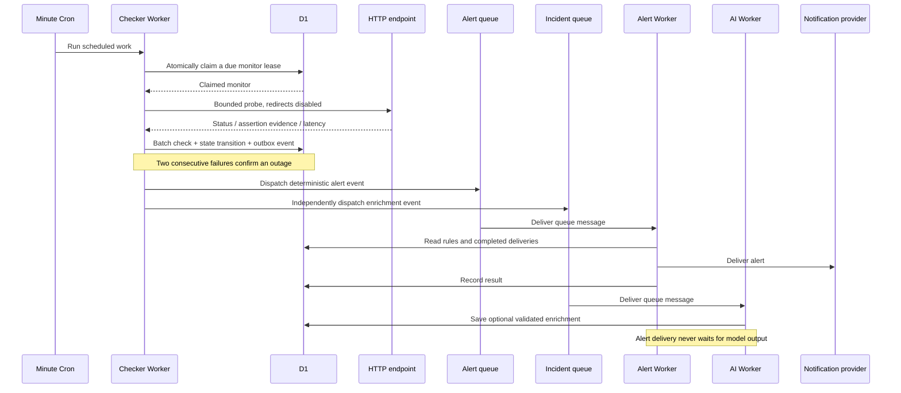

# Pulseflare: deployed architecture

[Live application](https://pulseflare.zlv.uk) · [Source overview](../README.md) · [Operating limits](FREE_TIER_OPERATIONS.md) · [Release verification](MVP_RELEASE.md)

This document describes the running beta. The earlier PRDs are design documents, not evidence that every proposed subsystem is deployed.

## Runtime boundaries

| Component | Responsibility | Implementation |
| --- | --- | --- |
| Pages + React/Vite | Static marketing/demo assets and authenticated UI; same-origin API proxy through a service binding | [Frontend](../frontend/src/App.tsx), [Pages proxy](../frontend/public/_worker.js), [route exclusions](../frontend/public/_routes.json) |
| API Worker + Hono | Clerk verification, workspace authorization, monitor configuration, heartbeat intake, incident updates, public snapshots, API keys | [API](../workers/api/src/index.ts) |
| Checker Worker + Cron | Minute wakeup, atomic claims for due monitors, probes, heartbeat deadlines, bounded cleanup, outbox dispatch | [Checker](../workers/checker/src/index.ts) |
| D1 | Tenants, configuration, check evidence, incident state, leases, outbox, delivery records, daily cost ledger | [Migrations](../migrations/) |
| Alert queue + consumer | Provider-specific delivery, encrypted integration settings, delivery records, retries | [Alert Worker](../workers/alert/src/index.ts) |
| Incident queue + AI consumer | Optional incident/anomaly summaries and advisory severity; quota and deterministic fallback | [AI Worker](../workers/ai/src/index.ts) |
| Cache API | Public snapshots (120 seconds) and history (45 seconds); cache hits avoid D1 altogether | [API](../workers/api/src/index.ts) |

There is no active Durable Object scheduler, R2 archive, or KV snapshot layer in this release. The design intentionally uses a small, bounded D1/cron deployment first.

## HTTP check to notification

Evidence, incident transitions, and outbox writes share a D1 batch transaction. Sending a queue message is separate: a failed handoff leaves a persisted event to retry. Alert and enrichment handoffs track their own progress, so one failing queue does not block the other.

Database claims serialize overlapping HTTP work without holding a transaction open across the network request. This is not a multi-region quorum or an exactly-once external execution guarantee. A future Durable Object scheduler needs measured alarm capacity and a tested state migration.

Key implementation: [monitoring transitions and outbox](../packages/shared/src/monitoring.ts), [scheduler tests](../tests/checker.test.ts), [incident/queue tests](../tests/mvp.test.ts).

## Heartbeats take a different path

A background job sends GET or POST to its secret heartbeat URL. D1 stores a hash of the token, not the full reusable URL; the UI reveals it only on creation or rotation. A valid ping records evidence and advances the deadline by the expected interval plus grace period.

The minute cron opens incidents for expired deadlines. A later ping resolves the outage through the same incident/outbox machinery as an HTTP monitor. Pause rejects pings; resume starts a fresh window. Detection depends on cron cadence and operational capacity, not an advertised sub-second SLA.

The deployed smoke test exercises an actual missed deadline, waits for cron to open the incident, sends a real POST ping, and verifies recovery. It does not merely simulate that lifecycle in the browser.

## Failure and retry model

| Failure | Behavior | Boundary |
| --- | --- | --- |
| Timeout or assertion mismatch | Store failed evidence; confirm an outage after consecutive failures | Failed probes do not establish root cause |
| Overlapping scheduler invocations | Atomic D1 leases prevent concurrent claims of the same HTTP work | Lease expiry is recovery, not global exactly-once execution |
| Queue handoff failure | Preserve outbox and retry independent handoffs | Queue acceptance and D1 bookkeeping cannot be one transaction |
| Duplicate alert message | Suppress channels with recorded successful delivery | A lost provider response can still duplicate external delivery |
| Provider failure | Record attempt and retry through the queue | Dead-letter inspection/manual replay UI are deferred |
| Invalid model output or model failure | Validate output and use deterministic fallback | AI is advisory; it does not gate alert delivery |
| Worker daily D1 guard exhausted | Retryable API 503, paused cron database work, queue retry | Monitoring pauses until capacity returns; no uptime guarantee |
| Public cache hit | Return public data without budget-ledger reads/writes | Cache is edge-local; cold misses still use D1 |

Generic webhooks include event IDs and idempotency headers, plus optional HMAC signing. Receivers can deduplicate using the event ID. The system does not claim exactly-once delivery to external providers.

## Tenant and secret boundaries

- Clerk authenticates users and organizations; the API resolves workspace membership and Admin/Member permissions. Queries bind the workspace ID rather than trusting an object ID alone.
- Scoped API keys are hashed, revocable, and denied unless stored scopes explicitly permit the operation. They do not bypass workspace authorization.
- HTTP request headers and integration settings use AES-GCM encryption. The shared key lives in Worker secrets, not browser variables. Request bodies are not claimed to be encrypted storage.
- Public snapshots include selected public monitors and explicitly published updates; private AI investigation notes are excluded.
- Probe/webhook validation rejects private literal addresses, internal hostnames, and unsafe URL forms. Probes do not follow redirects. **DNS-aware rebinding protection remains a launch gate**; this beta is not an unrestricted public probe service.
- Test-only auth bypass is loopback-restricted and must not be deployed. Development-mode Clerk is intentional; production keys and OAuth credentials remain a release task.

Regression coverage: [tenant/API-key boundaries](../tests/api.test.ts), [encryption and unsafe URLs](../tests/security.test.ts), [public-page selection and heartbeat secrets](../tests/mvp.test.ts).

## D1 cost is part of correctness

The prototype accumulated a large raw-check history. This deployment starts with a fresh schema, preserves the original account's data separately, and explicitly constrains query costs.

- History/statistics match composite indexes using workspace, monitor, and timestamp predicates. A **10,000-older-check** regression fixture catches accidental full-history scans.
- Anomaly detection reads at most 20 recent samples.
- Public cache hits bypass both database work and accounting. A ledger write on every cached request would defeat the cache's purpose.
- Raw history becomes unavailable after seven days. Hourly indexed cleanup removes at most 200 expired checks; backlogs can take longer to physically delete.
- SQLite triggers atomically enforce ten active monitors globally; the workspace cap is five. HTTP intervals cannot be shorter than five minutes.
- All four Workers share a ledger based on D1 `meta.rows_read` and `meta.rows_written`, with a **3,000,000 read / 60,000 write** daily project threshold and accounting headroom.

The ledger is not an exact account-wide billing cap. Concurrent work can modestly overshoot; REST SQL/migrations and other projects are outside its measurement. Account analytics and migration planning remain necessary. Frequent heartbeat pings and manual tests also consume writes.

Read [operating notes](FREE_TIER_OPERATIONS.md) before raising caps or importing history. Tests cover [rollover/budget enforcement](../tests/budget.test.ts) and indexed queries in [MVP tests](../tests/mvp.test.ts).

## What changes next

The next production gates are DNS-aware probe safety, production authentication, queue dead-letter operations, and account-wide observability. Durable Objects, rollups/R2 archives, maintenance suppression, and expanded product features follow their own completion criteria in [TODO.md](../TODO.md).

The running system, demo, and roadmap are separate: a polished preview is useful for exploring the product, but it is not evidence of production scale, paid customers, or completed future features.
