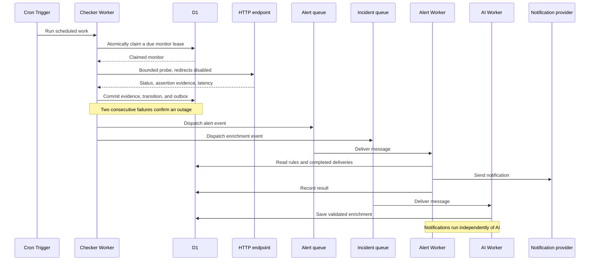

# Architecture

[Application](https://pulseflare.zlv.uk) · [Overview](../README.md) · [Operations](OPERATIONS.md) · [Deployment](DEPLOYMENT.md)

Pulseflare separates monitoring, notification delivery, and incident enrichment into independent Workers. D1 is the relational source of truth; queues carry incident transitions to the notification and AI consumers.

## Components

| Component                  | Responsibility                                                                                                              | Source                                                                            |
| -------------------------- | --------------------------------------------------------------------------------------------------------------------------- | --------------------------------------------------------------------------------- |
| Pages + React/Vite         | Static assets, authenticated workspace, same-origin API service binding                                                     | [Frontend](../frontend/src/App.tsx), [Pages proxy](../frontend/public/_worker.js) |
| API Worker + Hono          | Authentication, workspace authorization, monitor configuration, heartbeat intake, incident updates, API keys, public status | [API](../workers/api/src/index.ts)                                                |
| Checker Worker + Cron      | Scheduled checks, atomic leases, HTTP probes, heartbeat deadlines, retention, outbox dispatch                               | [Checker](../workers/checker/src/index.ts)                                        |
| D1                         | Tenants, configuration, check evidence, incidents, leases, outbox, delivery records, daily usage                            | [Migrations](../migrations/)                                                      |
| Alert queue + Worker       | Provider-specific delivery, encrypted integration settings, records, retries                                                | [Alert Worker](../workers/alert/src/index.ts)                                     |
| Incident queue + AI Worker | Workers AI summaries, advisory severity, validation, quotas, fallback                                                       | [AI Worker](../workers/ai/src/index.ts)                                           |
| Cache API                  | Public snapshots and history responses                                                                                      | [API](../workers/api/src/index.ts)                                                |

## Check lifecycle

D1 leases coordinate overlapping scheduler invocations without holding a database transaction open during the network request. Check evidence, incident transitions, and outbox writes share a batch transaction.

Queue dispatch happens after persistence. Each handoff tracks its own progress, so a failed AI handoff does not prevent alert dispatch. The outbox retains undispatched events for retry.

[Monitoring state and outbox](../packages/shared/src/monitoring.ts) · [Scheduler tests](../tests/checker.test.ts) · [Integration tests](../tests/mvp.test.ts)

## Heartbeats

Jobs send GET or POST requests to a secret ping URL. D1 stores the token's hash; the interface reveals the full URL on creation or rotation. Each accepted ping records evidence and advances the deadline by the expected interval plus grace period.

The minute cron checks expired deadlines and opens missed-run incidents. A later ping resolves the incident through the same state and outbox logic as HTTP monitoring. Pausing disables pings; resuming starts a fresh window.

## Delivery and recovery

| Condition                       | Handling                                                                   |
| ------------------------------- | -------------------------------------------------------------------------- |
| Timeout or assertion failure    | Persist check evidence; consecutive failures confirm an outage             |
| Overlapping scheduled work      | Atomic leases coordinate claims; expired leases allow recovery             |
| Failed queue handoff            | Retain the outbox event and retry each handoff independently               |
| Duplicate alert message         | Skip integrations with recorded successful delivery                        |
| Provider failure                | Record the failed attempt and retry through the queue                      |
| Model failure or invalid output | Use validated deterministic fallback text and severity                     |
| Database budget exhausted       | Return retryable 503s, pause scheduled database work, retry queue messages |
| Public cache hit                | Return cached data without database reads or ledger writes                 |

External notifications use at-least-once delivery. A lost provider response can cause a repeat delivery even when internal processing is idempotent. Generic webhooks include event IDs and idempotency headers, with optional HMAC signatures so receivers can verify and deduplicate events.

## Access and secrets

Incident chat runs through the authenticated API Worker using Llama 3.3 on Workers AI. D1 stores private conversation turns, evidence snapshots, and atomic request reservations. Follow-up prompts include a bounded window of the user's previous answers and only server-selected incident/check evidence, never request headers, integration credentials, or arbitrary client-provided context. Model output is advisory and cannot execute actions. Daily workspace and platform caps apply even to failed inference attempts. Answers include evidence identifiers and an inspectable source list.

Clerk authenticates users and organizations. The API resolves workspace membership and Admin/Member permissions, and binds workspace IDs in resource queries. Scoped API keys are hashed, revocable, and denied unless their stored scopes permit the operation.

HTTP request headers and notification integration settings use AES-GCM encryption. The shared encryption key lives in Worker secrets. Public snapshots include selected public monitors and published updates; private AI investigation notes stay within the workspace.

Target validation rejects private literal addresses, internal hostnames, and unsafe URL forms. Probes do not follow redirects. Validation is not a DNS-rebinding defense; configure endpoints you control. See [security tests](../tests/security.test.ts) and [authorization tests](../tests/api.test.ts).

## Database efficiency

Deployment annotations use workspace-scoped records and composite foreign keys for monitor associations. Creation and audit logging share a D1 batch. A canonical payload and workspace-unique idempotency key make CI retries safe; reusing a key with a different payload returns a conflict. Time-bounded, indexed queries return at most 20 records per page. Hourly cleanup removes at most 200 records older than 30 days.

Postmortems reference tenant-owned incidents. Deterministic drafts use recorded evidence and explicitly leave unconfirmed causes unresolved. Saves compare the report revision atomically, preventing silent overwrites between sessions. Export uses the saved revision. Neither reports nor deployment records are included in public snapshots, badges, or RSS.

SVG badges and RSS share the public-page selection boundary and 120-second cache policy with JSON snapshots. RSS reads only updates explicitly marked public for selected public monitors; output is XML-escaped.

History queries match composite indexes using workspace, monitor, and timestamp predicates. A regression fixture with 10,000 older checks exercises indexed history access. Anomaly detection reads at most 20 recent samples.

Cache hits bypass D1, including accounting writes. Public snapshots have a 120-second TTL; history responses have a 45-second TTL. Raw history is restricted to seven days, and hourly cleanup removes at most 200 expired checks per run.

SQLite triggers enforce deployment capacity atomically. A shared ledger measures D1 row costs across all four Workers and pauses new work at the configured daily threshold. [Operating parameters](OPERATIONS.md) describe the limits, reset behavior, and account-level accounting.
